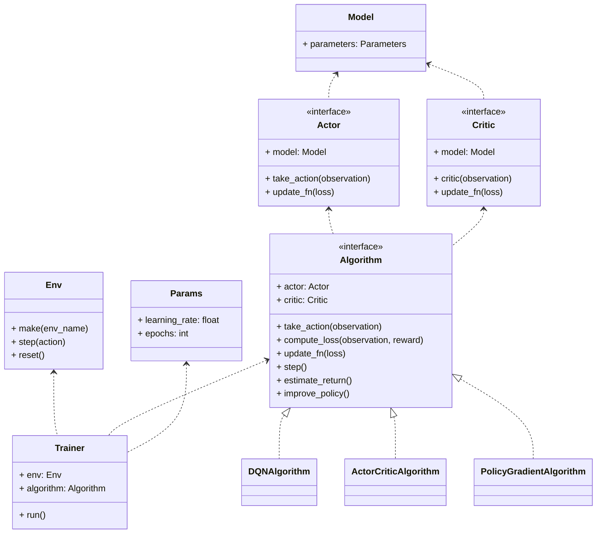

# jingwei

> 又北二百里，曰发鸠之山，其上多柘木，有鸟焉，其状如乌，文首，白喙，赤足，名曰：“精卫”，其鸣自詨。是炎帝之少女，名曰女娃。女娃游于东海，溺而不返，故为精卫，常衔西山之木石，以堙于东海。漳水出焉，东流注于河。
> 《山海经·北山经》

## 代码结构

## 强化学习组成

1. generate samples
2. policy evaluation
3. policy iteration

|算法|General Samples|Fit a model to estimate return|Improve the Policy|
|---|---|---|---|
|Policy Gradient|run the policy|$\hat{Q}^\pi(x_t, u_t) = \sum\limits_{t^\prime=t}^Tr(x_{t^\prime}, u_{t^\prime})$|$\theta \leftarrow \theta + \alpha\nabla_\theta j(\theta)$|
|Actor-Critic|run the policy|fit $\hat{V}_\phi^\pi$|$\theta \leftarrow \theta + \alpha\nabla_\theta j(\theta)$|
|Q-Learning|run the policy|$Q_\phi(s, a) \leftarrow r(s, a)+ \gamma\max_{a^\prime}Q_\phi(s^\prime, a^\prime)$|$a = \argmax_a Q_\phi(s, a)$|

|Component|Policy Gradient|Actor-Critic|DQN|
|---|---|---|---|
|General Sample|
|estimate return|
|improve policy|
|advantage|
|on-policy|
|off-policy|
|target network|
|replay buffer|

## LICENSE

MIT
