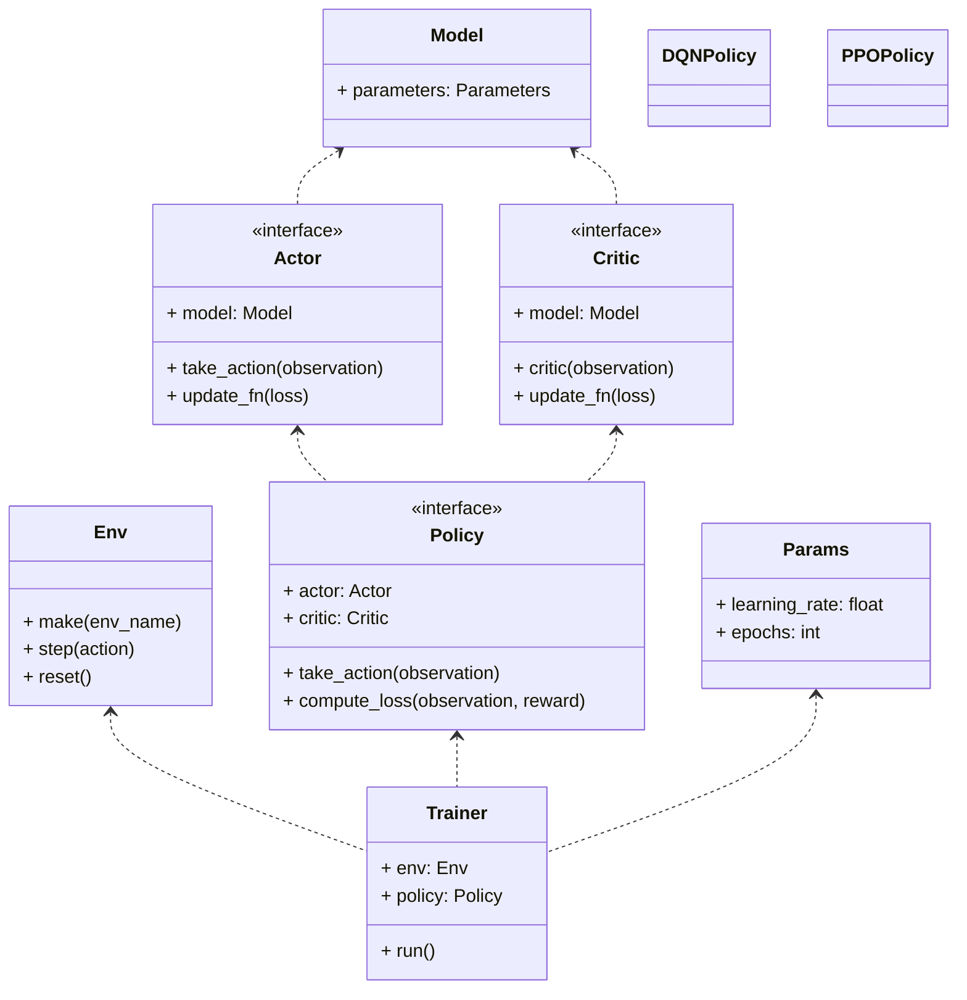

# jingwei

> 又北二百里，曰发鸠之山，其上多柘木，有鸟焉，其状如乌，文首，白喙，赤足，名曰：“精卫”，其鸣自詨。是炎帝之少女，名曰女娃。女娃游于东海，溺而不返，故为精卫，常衔西山之木石，以堙于东海。漳水出焉，东流注于河。
> 《山海经·北山经》

## 代码结构

```mermaid
classDiagram
    Env <.. Trainer
    Policy <.. Trainer
    Actor <.. Policy
    Critic <.. Policy
    Model <.. Actor
    Model <.. Critic
    Params <.. Trainer
    class Trainer {
        + env: Env
        + policy: Policy
        + run()
    }
    class Env {
        + make(env_name)
        + step(action)
        + reset()
    }
    class Policy {
        <<interface>>
        + actor: Actor
        + critic: Critic
        + take_action(observation)
        + compute_loss(observation, reward)
    }
    class Actor {
        <<interface>>
        + model: Model
        + take_action(observation)
        + update_fn(loss)
    }
    class Critic {
        <<interface>>
        + model: Model
        + critic(observation)
        + update_fn(loss)
    }
    class Model {
        + parameters: Parameters
    }
    class Params {
        + learning_rate: float
        + epochs: int
    }
    class DQNPolicy {

    }
    class PPOPolicy {

    }
```

## LICENSE

MIT
