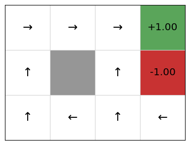
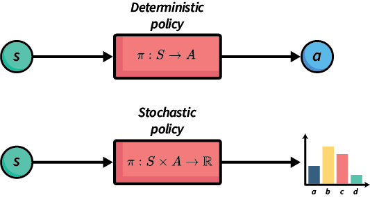

# Markov Decision Process

## 简介

马尔可夫决策过程（Markov Decision Process，简称MDP）是一种描述序列决策问题的框架。在机器学习中，分类和回归等问题属于一次性任务，即分类/回归模型接收输入并返回输出，而下一个输入与前一个完全独立。而在序列决策问题中，我们需要随时间推移做出一系列决策，每个决策都会影响未来的可能性。例如，从一个地点导航到另一个地点需要我们选择方向和速度，按该方向以该速度移动，然后反复做出这个决策直到到达目的地。因此，即使在第一步，我们也必须考虑每个移动如何影响未来。另一个例子是，临床医生在制定医疗治疗决策时必须考虑今天所做的决策是否会影响未来对患者的治疗方案。

在强化学习的术语中，我们将决策者称为智能体（agent），而他们的决策则是在环境或状态中执行的动作（actions）。

启发式搜索和经典规划算法等技术假设动作是确定性的——即智能体在执行动作之前，已知该动作将产生的确切结果。而MDP则去除了确定性事件的假设，转而假设每个动作可能有多种结果，每种结果都与一个概率相关联。如果每个动作只有一个结果（概率为1），那么问题是确定性的；否则，它是非确定性的。MDP考虑的是随机性非确定性，即结果服从某种概率分布。

MDP已成功应用于多个领域的规划问题：机器人导航、矿区开采区域规划、患者治疗方案制定、车辆维护调度，以及许多其他领域。

## Markov Decision Processes

马尔可夫决策过程（MDP）是一种完全可观察的概率状态模型。最常见的MDP表述是折扣奖励马尔可夫决策过程。折扣奖励MDP是一个包含以下元素的元组：

* 状态空间 $S$；
* 初始状态 $s_0$；
* 智能体可以在每个状态 $s$ 中执行的动作集合 $A(s)$；
* 状态转移概率 $P(s^{\prime}|s, a)$，表示在状态 $s$ 执行动作 $a$ 后转移到状态 $s^{\prime}$ 的概率；
* 奖励函数 $R(s, a, s^{\prime})$，表示从状态 $s$ 通过执行动作 $a$ 转移到状态 $s^{\prime}$ 所获得的正面或负面奖励；以及
* 折扣因子 $\gamma$。

状态是智能体可能处于的各种情况。每个状态都捕获了做出决策所需的信息。例如，在机器人导航中，状态包括机器人的位置、当前速度、行进方向以及障碍物、门等的位置。在为快递公司安排车辆维护的应用中，状态则包括车辆ID、车辆属性（如品牌、最大载重量等）、车辆位置、自上次维护检查以来行驶的公里数等。

状态空间简单来说就是所有可能状态的集合。也就是所有车辆ID、车辆属性、最大载重量等的组合。

动作允许智能体影响环境/状态——即动作使环境从一个状态转变为另一个状态。它们也是智能体在每个状态下可用的选择：我现在应该选择哪个动作？目前，我们假设只有智能体可以影响状态。

如前所述，一个动作可能有多种可能的结果。确切地说，只会发生一种结果，但智能体在执行动作之前并不知道会是哪一种。

转移概率告诉我们每个动作的效果，包括每种结果的概率。例如，在车辆维护任务中，当我们的智能体安排车辆进行检查时，可能的结果包括：(a) 不需要进一步维护（80%的概率）；(b) 需要小型维护（15%的概率）；或(c) 需要大型维护（5%的概率）。

奖励明确了在特定状态下执行特定动作的收益或成本。例如，导航到目的地的机器人在到达目的地时会获得正面奖励（收益），在途中撞到物体时会得到小的负面奖励（成本），而撞到人时则会得到大的负面奖励。

折扣因子 $\gamma$ 决定了未来奖励相比当前奖励应该被折扣多少。

例如，你是更喜欢今天获得100元还是一年后获得100元？我们（人类）通常会对未来进行折扣，并对更近期的奖励赋予更高的价值。

假设我们的智能体按顺序收到奖励 $r_1, r_2, r_3, ...$。如果 $\gamma$ 是折扣因子，那么折扣奖励为：

$$V = r_1 + \gamma r_2 + \gamma^{2}r_3 + \gamma^{3}r_4 + \cdots \\ = r1 + \gamma(r_2 + \gamma(r_3 + \gamma(r_4 + \cdots)))$$

如果 $V_t$ 是在时间步 $t$ 收到的奖励值，那么 $V_t = r_t + \gamma V_{t+1}$。因此，奖励离初始状态 $s_0$ 越远，我们从中获得的实际奖励就越少。

在MDP中，折扣因子必须严格小于1。稍后，我们将了解为什么这一点很重要。

### MDPs与确定性搜索的比较

您可能之前已经学习过搜索算法，例如经典规划或启发式搜索算法（如A\*）。

那么，MDP与基于搜索的解决方案有何不同呢？主要存在以下四点差异：

1. **转移函数不是确定性的**。在MDP中，如果在状态$s$执行动作$a$，则以概率$P_a(s^{\prime}|s)$转移到状态$s^{\prime}$；而在经典规划中，每个动作的结果是预先已知的。

2. **没有目标状态**。在MDP中，每个执行的动作都会获得奖励，而奖励的值取决于执行该动作时所处的状态。

3. **没有动作成本**。在MDP中，动作成本通过负奖励来建模。

4. **引入折扣因子**。在经典规划中，执行动作通常伴随一个成本；而在MDP中，小于1的折扣因子隐含地奖励了更短的计划（在其他条件相同的情况下）。

## 策略

折扣奖励MDP的规划问题与经典规划或启发式搜索不同，主要因为行动是非确定性的。与产生一系列确定性动作的传统规划不同，MDP的解决方案是一个策略。

> 定义：策略 $\pi$ 是一个函数，它告诉智能体在每个状态下应该选择哪个动作。策略可以是确定性的或随机性的。

在确定性策略中，对于每个状态 $s$，$\pi(s)$ 会返回一个特定的动作 $a$。而在随机策略中，$\pi(a|s)$ 表示在状态 $s$ 中选择动作 $a$ 的概率。

策略本质上回答了智能体在任何给定状态下应该做什么的问题，它提供了一种从状态到动作的映射。与经典规划中预先确定的动作序列不同，MDP的策略能够应对环境的不确定性，无论智能体转移到哪个状态，策略都能指导其选择适当的动作。

### 确定性策略 vs 随机策略

确定性策略 $\pi : S \rightarrow A$ 是一个将状态映射到动作的函数。它为每个可能的状态指定了应选择的动作。因此，如果我们处于状态 $s$，那么智能体应该选择由 $\pi(s)$ 定义的动作。网格世界（Grid World）问题中策略的图形表示如下：

例如，在初始状态（左下角单元格）中，按照此策略，智能体应该向上移动。如果它意外地向右滑动，则应该再次向左移动以返回到初始状态。

当然，智能体不会直接使用图形化的策略。规划算法的输出通常是类似字典的对象或一个接收状态并返回动作的函数。

随机策略 $\pi : S \times A \rightarrow \mathbb{R}$ 则指定了智能体应该从中选择动作的概率分布。直观地说，$\pi(s, a)$ 指定了在状态 $s$ 中执行动作 $a$ 的概率。

要执行随机策略，我们可以简单地选择具有最大 $\pi(s, a)$ 值的动作。然而，在某些领域，基于概率分布选择动作会更好；也就是说，按照概率比例选择动作，使得具有较高概率的动作被选择的可能性与其相对概率成正比。

图 2 展示了两者之间的区别。确定性策略的输出是一个具体动作。在相同状态下，确定性策略总是返回相同的动作。而随机策略的输出则是可能动作集合上的概率分布。通常，动作是根据该概率分布随机选择的。在图 2 中，动作 $b$ 最有可能被选择——比动作 $c$ 稍微可能一些。

我们可以使用随机策略来实现确定性策略：总是选择概率最高的动作。然而，随机策略通常在学习过程中随机使用，而一旦学习完成并部署智能体时，则会转为确定性使用。

在接下来的章节中，我们将主要关注确定性策略，但在讨论策略梯度方法时，随机策略将发挥重要作用。

## MDPs 的最优解

对于折扣奖励MDP，最优解是指从初始状态 $s_0$ 开始，最大化期望折扣累积奖励的策略。但是，什么是期望折扣累积奖励呢？

> 定义 - 期望折扣奖励(Excepted discounted reward)：策略 $\pi$ 从状态 $s$ 出发的期望折扣奖励为：

$$V^{\pi}(s) = E_{\pi}[\sum_{i} \gamma^i r(s_i, a_i, s_{i+1}) \mid s_0 = s, a_i = \pi(s_i)]$$

因此，$V^{\pi}(s)$ 定义了从状态 $s$ 开始遵循策略 $\pi$ 的期望价值。

对于我们的网格世界示例，假设只有-1和+1状态有奖励，期望价值是：

$$\begin{split} \begin{array}{lll} & \gamma^5 \times 1 \times (0.8^5) & \textrm{(最优移动)}\ + & \gamma^7 \times 1 \times (0.8^7) & \textrm{(仅第一步失败)}\ + & \ldots \textrm{(等等)} \end{array} \end{split}$$

定义 - 贝尔曼方程：由Richard Bellman提出的贝尔曼方程描述了策略要成为最优的必要条件。贝尔曼方程递归定义为：

$$V(s) = \max_{a \in A(s)} \sum_{s^{\prime} \in S} P_a(s^{\prime} \mid s)\ [r(s, a, s^{\prime}) + \gamma\ V(s^{\prime})]$$

这个方程表示状态 $s$ 的最优价值等于在该状态下选择最佳动作 $a$，然后考虑所有可能的下一个状态 $s^{\prime}$ 及其相应的转移概率和奖励，再加上折扣后的下一状态的价值。它捕捉了最优决策的核心原则：当前的最优决策必须考虑未来可能获得的最佳奖励。

贝尔曼方程为我们提供了一种递归方式来计算任何状态的最优价值，这是解决MDP问题的基础。

因此，如果对于所有状态 $s$，$V(s)$ 描述了在无限时间范围内选择具有最高奖励的动作所获得的总折扣奖励，那么 $V$ 就是最优的。

让我们来分解这个概念：

$$V(s) = \overbrace{\max_{a \in A(s)}}^{\text{从$s$选择最佳动作}} \overbrace{\underbrace{\sum_{s^{\prime} \in S}}{\text{对于每个状态}} P_a(s^{\prime} \mid s) [\underbrace{r(s, a, s^{\prime})}{\text{即时奖励}} + \underbrace{\gamma}{\text{折扣因子}} \cdot \underbrace{V(s^{\prime})}{\text{$s^{\prime}$的价值}}]}^{\text{在状态$s$执行动作$a$的期望奖励}}$$

首先，我们计算每个动作的期望奖励。一个动作的奖励是：该动作可能导致的所有状态的即时奖励之和，加上这些状态的折扣未来奖励。折扣未来奖励是折扣因子 $\gamma$ 乘以状态 $s^{\prime}$ 的价值 $V(s^{\prime})$，其中 $s^{\prime}$ 是我们最终到达的状态。然而，由于我们可能会到达多个不同的状态，我们必须将奖励乘以相应发生的概率：$P_a(s^{\prime} \mid s)$。

其次，状态价值 $V(s)$ 是具有最大期望奖励的动作的价值。这是因为贝尔曼方程假设一旦我们知道了最佳状态，我们总是会选择导向最佳状态的动作。

贝尔曼方程也可以用略微不同的方式描述，即使用所谓的 $Q$ 值。

如果 $V(s)$ 是处于状态 $s$ 并按照我们的最优策略行动的期望价值，那么我们也可以描述处于状态 $s$、选择动作 $a$，然后按照我们的最优策略行动的 $Q$ 值。

定义 - $Q$ 值：状态 $s$ 中动作 $a$ 的 $Q$ 值定义为：

$$Q(s, a) = \sum_{s^{\prime} \in S} P_a(s^{\prime} \mid s)\ [r(s, a, s^{\prime}) + \gamma\ V(s^{\prime})]$$

这代表了在状态 $s$ 中选择动作 $a$，然后一直遵循相同策略直到终止的价值。

这正是贝尔曼方程中 $\max$ 表达式内部的表达式。使用这个概念，贝尔曼方程可以重新定义为：

$$V(s) = \max_{a \in A(s)} Q(s, a)$$

这两种定义是等价的，你可能会看到它们以两种方式都被定义。然而，当我们稍后讨论 $Q$ 学习时，我们将更明确地使用 $Q$ 值。

## Policy extraction

给定一个价值函数 $V$，我们应该如何在给定状态中选择要执行的动作呢？这相当直接：选择使我们的期望效用最大化的动作！

所以，如果价值函数 $V$ 是最优的，我们可以使用以下公式选择具有最高期望奖励的动作：

$$\pi(s) = \text{argmax}{a \in A(s)} \sum{s^{\prime} \in S} P_a(s^{\prime} \mid s)\ [r(s, a, s^{\prime}) + \gamma\ V(s^{\prime})]$$

这被称为策略提取（policy extraction），因为它从价值函数（或 $Q$ 函数）中提取出一个策略。这可以在运行时"即时"计算，或者我们可以预先提取策略并使用。

另一种方法是，如果我们有 $Q$ 函数而不是价值函数，我们可以使用：

$$\pi(s) = \text{argmax}_{a \in A(s)} Q(s, a)$$

与使用价值函数相比，这种方法更简单，因为我们不需要对可能的输出状态集合进行求和。但权衡是，$Q$ 函数需要存储 $|A| \times |S|$ 个值，而价值函数只需要存储 $|S|$ 个值。

## Partially Observable MDPs

MDPs假设智能体始终确切地知道它所处的状态——问题是完全可观察的。然而，对于许多任务来说，这一假设并不成立；例如，在地震区搜索幸存者的无人机根据定义不会知道幸存者的位置；玩纸牌游戏的智能体不会知道背面朝下的牌是什么；等等。

定义 - 部分可观察马尔可夫决策过程

部分可观察马尔可夫决策过程（POMDPs）放松了完全可观察性的假设。POMDP定义为：

* 状态 $s \in S$
* 动作 $A(s) \subseteq A$
* 转移概率 $P_a(s^{\prime} \mid s)$，对于 $s \in S$ 和 $a \in A(s)$
* 初始信念状态 $b_0$
* 奖励函数 $r(s, a, s^{\prime})$
* 可能观察结果的集合 $Obs$
* 传感器模型，由概率 $O_a(o \mid s^{\prime})$ 给出，$o \in Obs$

传感器模型允许智能体观察环境。如果智能体执行动作 $a$，它以概率 $O_a(o \mid s^{\prime})$ 观察到状态 $s^{\prime}$。

解决POMDPs与解决MDPs类似。实际上，可以应用相同的算法。唯一的区别是我们将POMDP问题转化为具有新状态空间的标准MDP问题：每个状态是集合 $S$ 上的概率分布。因此，POMDP的每个状态都是一个信念状态，它定义了处于每个状态 $S$ 的概率。这导致状态空间呈指数级增长，所以POMDPs通常是更难解决的问题。

与MDPs一样，解决方案是将信念状态映射到动作的策略。最优策略最大化期望奖励。

我们不会在这些笔记中详细介绍这个主题。然而，POMDPs是MDPs的泛化，它们比标准MDPs更适合于自主规划的实际解决方案，因为智能体总是知道其所处世界的真实状态是不常见的。

## 要点总结

* 马尔可夫决策过程（MDPs）模拟了结果具有随机性的序列决策问题；尽管智能体可以在动作执行后观察到状态。
* MDPs可以通过代码、模拟器或模型来定义。
* MDP的解决方案是一个策略。
* 确定性策略是从状态到动作的映射。对于策略 $\pi$，术语 $\pi(s)$ 返回在状态 $s$ 中执行的动作。
* 随机策略是从状态-动作对到概率的映射。对于策略 $\pi$，术语 $\pi(s, a)$ 返回在状态 $s$ 中选择动作 $a$ 的概率。
* 最优策略最大化期望折扣奖励。
* 贝尔曼方程描述了策略要成为最优的必要条件。
