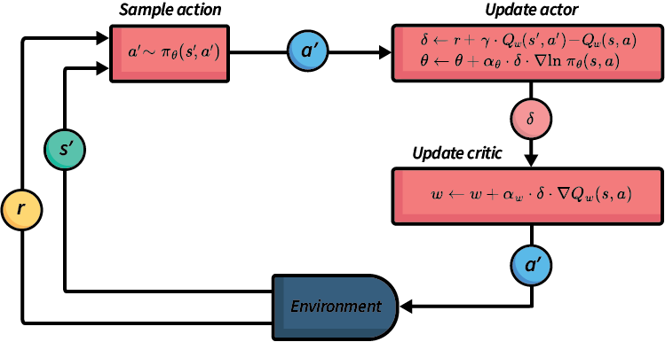

# Actor Critic

REINFORCE 算法中的样本效率问题导致策略收敛方面的困难。与蒙特卡洛模拟类似，跨回合累积奖励 $G$ 的高方差会引起训练的不稳定性。

Actor-critic 方法旨在缓解这一问题。其核心思想是不再单独学习价值函数或策略，而是同时学习两者。其中策略被称为 actor（行动者），而价值函数被称为 critic（评论者）。基本原理是由 actor 产生动作，而 critic 则像时序差分学习中那样，对这些动作提供反馈或"评价"，从而实现自举学习。

图 1 展示了 actor-critic 框架的抽象概述——此例中为 Q actor-critic。与 REINFORCE 类似，动作是从随机策略 $\pi_{\theta}$ 中采样得到的。给定下一个动作后，我们先更新 actor（策略），然后更新 critic（价值函数或 Q 函数）。所选动作在环境中执行，智能体随后接收奖励和下一状态的观察信息。

## Q Actor Critic

Q Actor Critic 算法使用 Q 函数作为 critic（评论者）。

$$
\begin{array}{l} Input:\ \text{MDP}\ M = \langle S, s_0, A, P_a(s' \mid s), r(s, a, s')\rangle\\ Input:\ \text{A differentiable actor policy}\ \pi_{\theta}(s, a)\\ Input:\ \text{A differentiable critic Q-function}\ Q_w(s, a)\\ Output:\ \text{Policy}\ \pi_{\theta}(s, a) \\[2mm] \text{Initialise actor}\ \pi\ \text{parameters}\ \theta\ \text{and critic parameters}\ w\ \text{arbitrarily}\\[2mm] Repeat\ \text{(for each episode}\ e\ \text{)}\\ \quad\quad s \leftarrow\ \text{the first state in episode}\ e\\ \quad\quad \text{Select action}\ a \sim \pi_\theta(s, a)\\ \quad\quad Repeat\ \text{(for each step in episode e)}\\ \quad\quad\quad\quad \text{Execute action}\ a\ \text{in state}\ s\\ \quad\quad\quad\quad \text{Observe reward}\ r\ \text{and new state}\ s'\\ \quad\quad\quad\quad \text{Select action}\ a' \sim \pi_\theta(s', a')\\ \quad\quad\quad\quad \delta \leftarrow r + \gamma \cdot Q_w(s', a') - Q_w(s, a)\\ \quad\quad\quad\quad w \leftarrow w + \alpha_w \cdot \delta \cdot \nabla Q_w(s, a)\\ \quad\quad\quad\quad \theta \leftarrow \theta + \alpha_{\theta} \cdot \delta \cdot \nabla \textrm{ln}\ \pi_{\theta}(s, a)\\ \quad\quad\quad\quad s \leftarrow s'; a \leftarrow a'\\ \quad\quad Until\ s\ \text{is the last state of episode}\ e\ \text{(a terminal state)}\\ Until\ \pi_{\theta}\ \text{converges} \end{array}
$$

注意，我们为 Q 函数和策略分别设置了两个不同的学习率 $\alpha_w$ 和 $\alpha_{\theta}$。

让我们更详细地分析关键部分。更新 $\delta$ 的那一行与 SARSA 中的 $\delta$ 计算相同：它是在状态 $s$ 中执行动作 $a$ 的时序差分值，其中未来折扣奖励的估计为 $Q_w(s', a')$。

一旦计算出 $\delta$ 值，我们就同时更新 actor 和 critic。critic $Q_w$ 的权重通过沿着 critic Q 函数在 $s, a$ 处的梯度 $\nabla Q_w(s, a)$ 方向更新，然后 actor 的参数 $\theta$ 按照与 REINFORCE 相同的方式更新，只不过 $\delta$ 的值使用基于 $Q_w(s, a)$ 的时序差分估计，而不是使用 $G$。

因此，这种方法同时学习策略（actor）$\pi_{\theta}$ 和评论者（critic Q 函数）$Q_w$，但 critic 的学习仅用于提供时序差分更新，而非直接提取策略。

但等等！我们不是曾经说过，基于价值的方法的弱点在于它们无法扩展到连续动作空间吗？现在引入 Q 函数，我们是不是倒退了？为什么不直接使用 Q 函数呢？

Actor-critic 方法之所以仍然有效，是因为 actor 策略 $\pi_{\theta}$ 为我们选择动作，而 critic $Q_w(s, a)$ 仅用于计算已选动作的时序差分估计。我们不需要遍历 critic Q 函数来选择动作，因此不必遍历整个动作集合——我们只需使用策略。这样，该方法仍然可以扩展到连续和大型状态空间，并且在大型动作空间中更加高效。

## 总结

1. 与 REINFORCE 类似，actor-critic 方法也是基于策略梯度的，因此直接学习策略，而不是先学习价值函数或 Q 函数。
2. Actor-critic 方法同时也学习价值函数或 Q 函数，以减少累积奖励中的方差。
