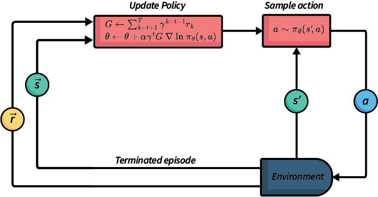

# 策略梯度

## 简介

正如前文所述，基于策略的方法直接搜索策略，而非先搜索价值函数再提取策略。本节中，我们将探讨一种直接优化策略的无模型方法。该方法与Q学习和SARSA相似，但区别在于它不更新Q函数，而是使用梯度上升直接更新策略的参数 $\theta$。

在策略梯度方法中，我们通过回合中获得的奖励和动作来近似策略，这与Q学习的方式类似。要应用这种方法，策略必须具备两个特性：

1. 策略必须使用对其参数可微分的函数表示。对于不可微分的策略，我们无法计算梯度。
2. 通常，我们需要策略是随机的。回顾策略章节，随机策略定义了动作上的概率分布，指明了选择每个动作的概率。

策略梯度的目标是通过对期望回报进行梯度上升来近似最优策略 $\pi_{\theta}(s, a)$。梯度上升将为特定的马尔可夫决策过程找到最佳参数 $\theta$。

## 梯度上升

梯度上升的目标是找到能够最大化期望回报的策略函数权重。这是通过迭代计算数据梯度并更新策略权重来实现的。

具有参数 $\theta$ 的策略 $\pi_{\theta}$ 的期望值定义为：

$$J(\theta) = V^{\pi_{\theta}}(s_0)$$

其中 $V^{\pi_{\theta}}$ 是使用策略 $\pi_{\theta}$ 的策略评估，$s_0$ 是初始状态。这个表达式在计算上非常昂贵，因为我们需要从 $s_0$ 执行到每个终止状态的所有可能回合，这可能是无限数量的回合。因此，我们使用策略梯度算法来近似它。这些算法通过使用回合样本，沿着策略相对于参数 $\theta$ 的梯度上升，寻找 $J(\theta)$ 的局部最大值。

给定策略目标 $J(\theta)$，$J$ 相对于 $\theta$ 的策略梯度，记为 $\nabla_{\theta}J(\theta)$，定义为：

$$\begin{split} \nabla_{\theta}J(\theta) = \begin{pmatrix} \frac{\partial J(\theta)}{\partial \theta_1} \ \vdots \ \frac{\partial J(\theta)}{\partial \theta_n} \end{pmatrix} \end{split}$$

其中 $\frac{\partial J(\theta)}{\partial \theta_i}$ 是 $J$ 相对于 $\theta_i$ 的偏导数。

如果我们想沿着梯度朝着问题的最优 $J(\theta)$ 前进，我们使用梯度并更新权重：

$$\theta \leftarrow \theta + \alpha \nabla J(\theta)$$

其中 $\alpha$ 是学习率参数，决定了沿梯度方向步长的大小。

问题是：$\nabla J(\theta)$ 是什么？策略梯度定理（参见 Sutton 和 Barto，第 13.2 节）指出，对于任何可微分策略 $\pi_{\theta}$、状态 $s$ 和动作 $a$，$\nabla J(\theta)$ 为：

$$\nabla J(\theta) = \mathbb{E}[\nabla\ \textrm{ln} \pi_{\theta}(s, a) Q(s, a)]$$

表达式 $\textrm{ln} \pi_{\theta}(s, a)$ 告诉我们如何改变权重 $\theta$：增加在状态 $s$ 中选择动作 $a$ 的对数概率。如果在 $s$ 中选择动作 $a$ 的质量为正，我们会增加该概率；否则我们减少该概率。因此，这是采取动作 $\pi_{\theta}(s, a)$ 的期望回报乘以梯度。

在这些笔记中，我们不会深入讨论梯度或求解它们的算法细节——这本身就是一个在强化学习之外也相关的大型主题。相反，我们只会提供直觉并说明如何将其用于无模型强化学习。

## Reinforce

REINFORCE算法是策略梯度方法的一种实现。由于计算最优梯度的代价过高——这需要解决模型中所有可能的轨迹，因此我们无法直接计算最优梯度。在REINFORCE中，我们通过采样轨迹来近似梯度，类似于蒙特卡洛强化学习中的采样过程。

下图展示了REINFORCE算法的抽象概览。该算法通过从策略中采样生成新的动作并执行它们。当一个回合结束后，算法使用奖励和状态列表来更新策略，这表明策略仅在每个回合结束时更新。

$$
\begin{array}{l} Input:\ \text{A differentiable policy}\ \pi_{\theta}(s, a), \ \text{an MDP}\ M = \langle S, s_0, A, P_a(s' \mid s), r(s, a, s')\rangle\\ Output:\ \text{Policy}\ \pi_{\theta}(s, a)\\[2mm] \text{Initialise parameters}\ \theta\ \text{arbitrarily}\\[2mm] Repeat\\ \quad\quad \text{Generate episode}\ (s_0, a_0, r_1, \ldots s_{T-1}, a_{T-1}, r_{T})\ \text{by following}\ \pi_{\theta}\\ \quad\quad foreach\ (s_t, a_t)\ \text{in the episode}\\ \quad\quad\quad\quad G \leftarrow \sum_{k=t+1}^{T} \gamma^{k-t-1} r_k\\ \quad\quad\quad\quad \theta \leftarrow \theta + \alpha \gamma^{t} G\ \nabla\ \textrm{ln}\ \pi_{\theta}(s, a)\\ until\ \pi_{\theta}\ \text{converges} \end{array}
$$

REINFORCE通过蒙特卡洛模拟生成完整回合，遵循目前的策略并使用随机策略 $\pi_{\theta}$ 采样动作。它根据动作的概率进行采样，即 $a \sim \pi_{\theta}(s, a)$。

然后，算法遍历回合中的每个动作，计算轨迹的总未来折扣奖励 $G$。利用这个奖励，它计算策略梯度 $\pi$ 并将其乘以 $G$ 的方向。因此，随着 $\pi$ 的改进，算法生成越来越好的策略。

与基于价值的技术相比，我们可以看到REINFORCE（以及其他策略梯度方法）在策略改进过程中不评估每个动作。在策略迭代中，我们通过 $\pi(s) \leftarrow \textrm{argmax}_{a \in A(s)} Q^\pi(s, a)$ 更新策略。而在REINFORCE中，最近采样的动作及其奖励用于计算梯度和更新。

这种方法的优势在于，当动作空间或状态空间是连续的时（例如，存在一个或多个带有连续值参数的动作），策略梯度方法仍然适用。这是因为它使用梯度而不是显式地进行策略改进。基于同样的原因，当动作数量很大时，策略梯度方法通常比基于价值的方法更高效。

## 优缺点

### 优点

高维问题处理能力：策略梯度方法相比Q学习和SARSA等基于价值的技术的主要优势在于它们能够处理高维动作和状态空间，包括连续的动作和状态。这是因为我们不必像在基于价值的方法中那样使用 $\textrm{argmax}{a \in A(s)}$ 来遍历所有动作。对于连续问题，$\textrm{argmax}{a \in A(s)}$ 无法计算，而对于大量动作的情况，计算复杂度取决于动作数量。

### 缺点

样本效率低：由于策略梯度算法需要完成整个回合才能进行更新，很难确定哪些状态-动作对影响了回合奖励 $G$，因此难以确定应该采样哪些状态-动作对。

可解释性差：无模型强化学习本身就难以理解和解释策略为何做出特定决策。这主要是由于无模型的特性：没有可用的动作定义，因为这些是未知的。而策略梯度方法尤其难以解释，因为状态的价值是未知的：我们只有一个结果策略。相比之下，使用基于价值的方法，了解 $V$ 或 $Q$ 可以提供一些关于策略选择动作原因的见解；尽管可解释性问题仍然存在。

## 总结

* 像REINFORCE这样的策略梯度方法直接学习策略，而不是先学习价值函数或Q函数。
* 使用轨迹样本，策略的参数通过沿梯度向上更新——这与梯度下降原理相同，但方向相反。
* 与策略迭代不同，策略梯度方法是无模型的。
