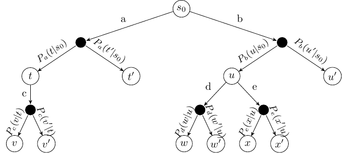
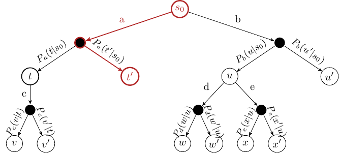
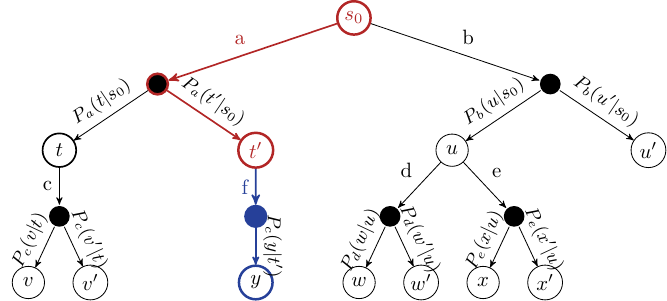
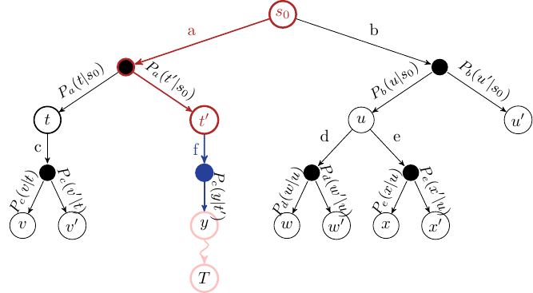
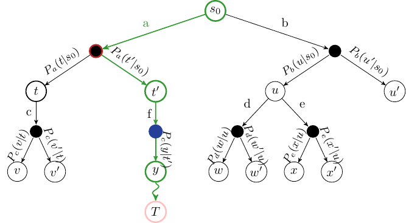

# MCTS

## MDP的离线规划与在线规划

我们在前一节中看到了价值迭代。这是一种离线规划方法，因为我们在离线状态下为所有可能的状态解决问题，然后在线使用解决方案（策略）来行动。

然而，状态空间 $S$ 通常过于庞大，无法精确确定 $V(s)$ 或 $\pi$。即使是围棋这样的游戏，对强化学习来说也是著名的难题，需要只有少数组织才能获得的计算能力，与许多现实世界的问题相比，它们仍然很小。

有一些方法可以通过降低 $S$ 的维度来近似MDP，但我们将在后面再讨论这些方法。

蒙特卡洛模拟
在在线规划中，规划是在执行动作之前立即进行的。一旦执行了一个动作（或者可能是一系列动作），我们就从新状态开始重新规划。因此，规划和执行是交织在一起的，使得：

* 对于每个访问的状态 $s$，所有可用动作 $A(s)$ 被部分评估
* 每个动作 $a$ 的质量通过对 $s$ 上重复模拟获得的轨迹的期望奖励平均值来近似，从而得到 $Q(s, a)$ 的近似值
* 选择的动作是 $\pi(s) = \text{argmax}_{a \in A(s)} Q(s, a)$
 
在在线规划中，我们需要访问一个模拟器，它近似我们MDP的转移函数 $P_a(s'|s)$ 和奖励函数 $r(s, a, s')$。可以使用模型，但是，通常编写一个能够以概率 $P_a(s'|s)$ 选择结果的模拟比为任何状态分析计算概率更容易。例如，考虑像星际争霸这样的游戏。计算给定动作后最终状态的概率比模拟可能的状态更加困难。

模拟器允许我们运行重复的可能未来模拟，以获得哪些行动可能比其他行动更好的想法。

问题是：我们如何进行重复模拟？蒙特卡洛方法是迄今为止最广泛使用的方法。

## 简介

### MDPs as ExpectiMax Trees

要理解MCTS的思想，我们注意到MDP可以表示为树（或图），称为ExpectiMax树：

字母$A$-$C$表示动作，字母$S$-$Z$表示状态。白色节点是状态节点，小黑点表示概率不确定性：即"环境"基于转移函数选择动作的哪种结果发生。

### Monte Carlo Tree Search

该算法是在线的，这意味着动作选择与动作执行交织在一起。因此，每当智能体访问新状态时，就会调用MCTS。

基本特征：

1. 每个状态-动作对的Q值$Q(s, a)$通过随机模拟来近似。
2. 对于单智能体问题，ExpectiMax搜索树是增量构建的。
3. 当使用完某些预定义的计算预算时（如时间限制或展开节点数量），搜索终止。因此，它是一种随时可用的算法，可以在任何时间终止并仍然给出答案。
4. 返回表现最佳的动作。
   1. 如果没有死胡同，这是完备的。
   2. 如果可以执行完整搜索，这是最优的（这种情况很少见 - 如果问题规模很小，我们应该直接使用动态规划技术，如价值迭代）。

## MCTS 框架

基本框架是使用模拟构建树。已评估的状态存储在搜索树中。评估状态的集合通过迭代以下四个步骤逐步构建：

1. 选择(Selection)：在树中选择一个尚未完全展开的节点。这里所说的完全展开是指该节点的所有子节点都已被探索。
2. 扩展(Exansion)：通过应用该节点的一个可用动作（由MDP定义）来扩展此节点。
3. 模拟(Simulate)：从扩展节点的一个结果状态开始，执行MDP的完整随机模拟直到达到终止状态。这假设模拟是有限的，但MCTS也有一些变体，我们只执行一段时间然后估计结果。
4. 反向传播(Backpropagate)：最后，节点的值被反向传播到根节点，在此过程中使用期望值更新每个祖先节点的值。

### Selection

从根节点开始，依次选择子节点，直到到达一个尚未完全展开的节点。

### Expansion

除非我们最终到达的节点是终止状态，否则通过选择一个动作并使用该动作的结果创建新节点来展开所选节点的子节点。

### Simulation

选择其中一个新节点，并执行MDP的随机模拟直至终止状态。

### Backpropagation

给定终止状态的奖励 $r$，将该奖励反向传播，以计算路径上每个状态的值 $V(s)$。

## 算法

在基本的MCTS算法中，我们增量构建搜索树。树中的每个节点存储：

1. 一组子节点；
2. 指向其父节点和父动作的指针；以及
3. 该节点被访问的次数。

我们使用这棵树探索不同的蒙特卡洛模拟，以学习一个Q函数 $Q(s, a)$。

$$\begin{array}{l}
  Input:\ \text{MDP}\ M = \langle S, s_0, A, P_a(s' \mid s), r(s, a, s')\rangle, \text{base Q-function}\ Q, \text{time limit}\ T  \\
  Output:\ \text{updated Q-function}\ Q  \\[2mm]
  While\ current\_time < T\ do  \\
  \quad\quad selected\_node \leftarrow \text{Select}(s_0)  \\
  \quad\quad child \leftarrow \text{Expand}(selected\_node)\ \text{-- expand and choose a child to simulate}  \\
  \quad\quad G \leftarrow \text{Simulate}(child)\ \text{ -- simulate from}\ child\\
  \quad\quad \text{Backpropagate}(selected\_node, child, Q, G)  \\
  Return \ Q
\end{array}$$

基于此，算法主要包含四个部分：

1. 选择：第一个循环使用多臂赌博机算法基于 $UCB1(s, a)$ 逐步选择树中的一个分支。动作产生的结果根据MDP中定义的 $P_a(s'|s)$ 选择。

$$\begin{array}{l}
  Input:\ \text{state}\ s  \\
  Output:\ \text{unexpanded state} s  \\[2mm]
  While\ s\ \text{is fully expanded}\ do  \\
  \quad\quad \text{Select action}\ a\ \text{to apply in}\ s\ \text{using a multi-armed bandit algorithm}  \\
  \quad\quad \text{Choose one outcome}\ s'\ \text{according to}\ P_a(s' \mid s)  \\
  \quad\quad s \leftarrow s'  \\
  Return\ s
\end{array}$$

2. 扩展：在状态 $s$ 中选择一个动作 $a$ 应用，可以随机选择或使用启发式方法。根据概率分布 $P_a(s'|s)$ 获得在状态 $s$ 中应用动作 $a$ 后的结果状态 $s'$。为该结果扩展一个新的环境节点和状态节点。

$$
\begin{array}{l}
  Input:\ \text{state}\ s  \\
  Output:\ \text{expanded state} s'  \\[2mm]
  if\ s\ \text{is fully expanded}\ then \\
  \quad\quad \text{Randomly select action}\ a\ \text{to apply in}\ s\   \\
  \quad\quad \text{Expand one outcome}\ s'\ \text{according to}\ P_a(s' \mid s)\ \textrm{and observe reward}\ r  \\
  Return\ s'
\end{array}
$$

3. 模拟：执行MDP的随机模拟直到达到终止状态。即，在每个选择点，随机选择MDP中的可能动作，并使用转移概率 $P_a(s'|s)$ 为每个动作选择结果。可以使用启发式方法来改进随机模拟，引导其朝向更有希望的状态。$R(s)$ 是从状态 $s$ 开始直到模拟终止所获得的累积折扣奖励。

   为避免内存爆炸，我们丢弃模拟过程中生成的所有节点。在任何非平凡的搜索中，我们不太可能再次需要它们。

4. 反向传播：模拟的奖励从选定节点递归地反向传播到其祖先节点。我们不能忘记折扣因子！对于在选择步骤中选定的每个状态 $s$ 和动作 $a$，更新该状态的累积奖励。

$$
\begin{array}{l}
  Input:\ \text{state-action pair}\ (s, a), \text{Q-function}\ Q, \ \text{rewards}\ G\\
  Output:\ \text{none} \\[2mm]
  do  \\
  \quad\quad N(s, a) \leftarrow N(s, a) + 1  \\
  \quad\quad G \leftarrow r + \gamma G  \\
  \quad\quad Q(s, a) \leftarrow Q(s, a) + \tfrac{1}{N(s, a)}[G - Q(s, a)]   \\
  \quad\quad s \leftarrow\ \text{parent of}\ s  \\
  \quad\quad a \leftarrow\ \text{parent action of}\ s  \\
  while\ s \neq s_0
\end{array}
$$

因为动作结果是根据 $P_a(s'|s)$ 选择的，这将收敛到平均期望奖励。这就是为什么该树被称为ExpectiMax树：我们最大化期望回报。

但是：如果我们不知道 $P_a(s'|s)$ 怎么办？

只要我们能够模拟结果，例如使用基于代码的模拟器，这就不重要。经过多次模拟，选择（以及扩展/执行步骤）将对 $P_a(s'|s)$ 进行足够接近的采样，使得 $Q(s, a)$ 将收敛到平均期望奖励。请注意，这不是一种无模型方法：我们仍然需要以模拟器形式的模型，但不需要显式的转移和奖励函数。

## 选择动作

一旦我们的计算时间用尽，我们就选择能够最大化期望回报的动作，这实际上就是在我们的模拟中具有最高Q值的动作：

$$\text{argmax}_{a \in A(s)} Q(s_0, a)$$

我们执行该动作并等待观察该动作产生的结果。

一旦我们看到了结果状态，我们称之为 $s'$，我们就从 $s'$ 开始重新进行整个过程。

然而，重要的是，我们可以保留从状态 $s'$ 开始的子树，因为我们已经从该状态进行了模拟。我们丢弃树的其余部分（除了所选动作外，$s_0$ 的所有子节点），并从 $s'$ 开始增量构建。

## Upper Confidence Trees(UCT)

当我们选择节点时，我们使用某种多臂赌博机算法进行选择。虽然可以使用任何多臂赌博机算法，但在实践中，UCB1算法的slight变体在MCTS中已被证明非常成功。

上置信界树（UCT）算法是MCTS与UCB1策略的结合，用于选择下一个要探索的节点：

$$UCT = MCTS + UCB1$$

UCT选择策略与UCB1策略类似：

$$\text{argmax}_{a \in A(s)} Q(s, a) + 2 C_p \sqrt{\frac{2 \ln N(s)}{N(s, a)}}$$

其中 $N(s)$ 是状态节点被访问的次数，$N(s, a)$ 是从该节点选择动作 $a$ 的次数。$C$ 是探索常数，增大它可以鼓励更多的探索，减小则会减少探索。当多个动作具有相同值时，随机打破平局。

### 函数近似

与标准Q-学习类似，我们可以使用Q函数近似来帮助在MCTS中泛化学习。

特别地，我们可以使用离线方法（如Q-学习或SARSA）结合Q函数近似来学习一个通用的Q函数。这种方法通常效果不错，然而，Q函数近似的问题在于，在执行过程中，近似方法对某些状态可能效果不佳。

为了缓解这个问题，我们可以使用MCTS（在线规划）从实际状态开始搜索，但以预训练的Q函数为起点。这有两个好处：

1. MCTS通过从实际初始状态 $s_0$ 运行模拟来补充预训练的Q函数，这可能比预训练的Q函数（考虑到它是一种近似）更准确地反映真实奖励。
2. 预训练的Q函数通过引导选择步骤来改进MCTS搜索。实际上，早期模拟不那么随机，因为有一些信号可以使用。这有助于缓解冷启动问题，即在学习开始时我们没有可利用的信息。

## 价值迭代与MCTS的比较

通常，从初始状态 $s_0$ 使用最优策略可达到的状态集合远小于总状态集合。在这方面，价值迭代是穷尽式的：它计算了在已知初始状态的情况下永远不会遇到的状态的行为。

MCTS（以及其他搜索方法）因此可以仅通过从 $s_0$ 开始采样来使用。然而，结果不如使用价值/策略迭代那样通用：所得解决方案仅适用于已知的初始状态 $s_0$ 或使用模型中定义的动作从 $s_0$ 可达的任何状态。而价值迭代适用于任何状态。

| |价值迭代|MCTS|
|---|---|---|
|成本|更高（穷尽式）|	更低（不需解决整个状态空间）|
|覆盖率/鲁棒性|	更高（适用于任何状态|	更低（仅适用于初始状态或从初始状态可达的状态）|

这一点很重要：价值迭代对许多问题来说成本更高，但是，对于在环境中运行的智能体，我们只需穷尽求解一次，然后无论后来处于什么状态，都可以多次使用所得策略。

对于MCTS，每当我们遇到之前未考虑过的状态时，都需要在线求解。正如我们所见，即使对于像网格世界这样的简单问题，在一秒内进行多次模拟也不会产生良好的策略；但通过对算法的精心设计（避免重复状态，使用启发式方法进行模拟），可以改进这一点。

## 结合MCTS和TD学习：AlphaZero

AlphaZero（或更准确地说，其前身AlphaGo）在2016年击败围棋世界冠军李世石时成为头条新闻。它结合了MCTS和（深度）强化学习来学习策略。

简要概述：

1. AlphaZero使用深度神经网络来估计Q函数。更准确地说，它给出了在状态 $s$ 中选择动作 $a$ 的概率 $P(a|s)$ 的估计，以及状态的价值 $V(s)$，表示玩家从 $s$ 获胜的概率。
2. 它通过自我对弈进行训练。自我对弈是指使用相同的策略来生成学习智能体及其任何对手的动作。在AlphaZero中，这意味着最初，双方玩家都会随机移动，但双方也会学习相同的策略并用它来选择后续动作。
3. 在每一步中，AlphaZero：
   1. 执行使用类UCB选择的MCTS搜索：$Q(s, a) + c P(a|s) \sqrt{\frac{\ln N(s)}{N(s, a)}}$，返回每个动作的概率。
   2. 神经网络通过影响 $P(·|·, ·)$ 来指导MCTS。
   3. 模拟游戏的最终结果被用作每次模拟的奖励。
   4. 经过一定数量的MCTS模拟后，为自我对弈选择最佳动作。
   5. 对每一步重复步骤1-4，直到自我对弈游戏结束。
   6. 然后，将自我对弈游戏的结果反馈，以更新每一步的 $P(·|·, ·)$ 函数。

AlphaZero最好用2017年AlphaZero Nature论文中的以下图表来总结：

## 总结

1. 蒙特卡洛树搜索（MCTS）是一种随时可用的搜索算法，特别适合于随机域，如MDP。
   1. 可用于基于模型或基于模拟的问题。
   2. 智能选择策略对于良好性能至关重要。
2. UCT是MCTS和UCB1的结合，是许多问题上的成功算法。
