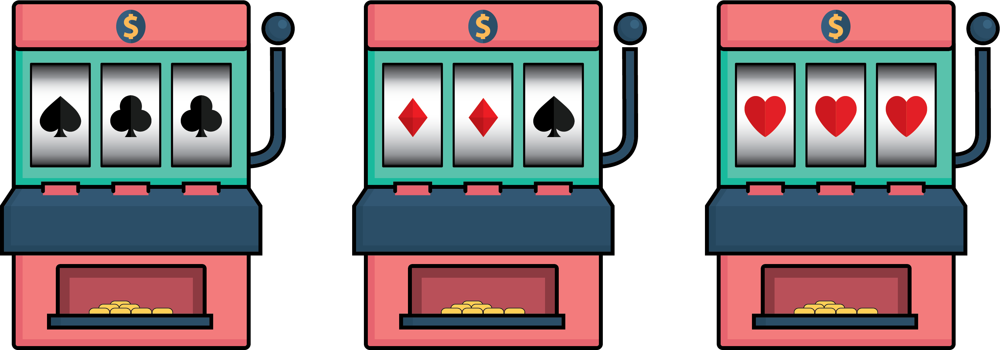
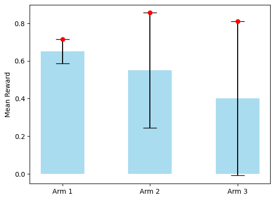

# Multi Armed Bandits

## 简介

多臂老虎机技术并非解决马尔可夫决策过程（MDPs）的技术，但它们在许多能够解决MDPs的强化学习技术中被广泛应用。

多臂老虎机问题可以这样描述：

假设您有 $N$ 台老虎机（在澳大利亚也称为扑克机），由于侧面有一个人们拉动以再次运行的"臂"，它们有时被称为单臂老虎机。随着时间的推移，每台老虎机会从一个未知的概率分布中随机支付奖励。一些老虎机比其他老虎机更可能获得较高的回报——但我们在开始时并不知道哪些是这样的。目标是最大化一系列拉动机器的总奖励。

问题是：在事先不知道概率分布的情况下，我们应该如何选择拉动哪些老虎机臂以增加我们的总回报？多臂老虎机技术旨在解决这个问题。

## 多臂老虎机问题

> 定义: 多臂老虎机（也称为 $N$ 臂老虎机）由一组随机变量 $X_{i, k}$ 定义，其中：
> * $1 \leq i \leq N$，$i$ 表示老虎机的臂；
> * $k$ 表示拉动臂 $i$ 的次数索引；

> 假设连续拉动 $X_{i, 1}, X_{j, 2}, X_{k, 3}\ldots$ 是独立分布的，但我们不知道这些随机变量的概率分布。

> 基本思想是，一个赌徒会迭代地进行多轮游戏，每轮之后观察从所选臂获得的奖励，并可以相应地调整他们的策略。目标是最大化所有轮次中收集到的奖励总和。
> 多臂老虎机策略旨在学习一个策略 $\pi(k)$，其中 $k$ 是游戏轮次。

鉴于我们不知道概率分布，一个简单的策略是根据均匀分布选择臂；也就是说，以相同的概率选择每个臂。这仅仅是均匀采样。

然后，动作 $a$ 的 Q 值可以使用以下公式估计：

$$Q(a) = \frac{1}{N(a)} \sum_{i=1}^{t} X_{a, i}$$

其中 $t$ 是到目前为止的轮数，$N(a)$ 是在之前轮次中选择 $a$ 的次数，$X_{a, i}$ 是在第 $i$ 轮中拉动臂 $a$ 获得的奖励。

这里的思想是，对于多臂老虎机问题，我们先均匀地探索一段时间的选项，然后一旦我们确信有足够的样本（当 $Q(a)$ 值的变化开始稳定时），我们开始选择 $\text{argmax}_a Q(a)$。这被称为 $\epsilon$-first 策略，其中参数 $\epsilon$（epsilon）决定了在转向贪婪动作之前选择随机动作的轮数。

但问题是什么呢？使用均匀分布会在所有动作上平等地浪费时间。相反，我们可以根据到目前为止收到的奖励，专注于最有希望的动作。

## 探索与利用

我们的目标是只玩好的动作；也就是说，继续选择那些到目前为止给我们带来最佳奖励的动作。然而，在开始时，我们没有信息告诉我们哪些是最佳动作。因此，我们需要既能利用我们认为目前为止最好的动作，又能继续探索其他动作的策略。

但我们应该进行多少利用和多少探索呢？这就是所谓的探索与利用的困境。它受到"错失恐惧症"（FOMO：Fear of Missing Out）的驱动。FOMO促使我们寻找能够最小化遗憾的策略。

定义 — 遗憾

给定一个策略 $\pi$ 和 $t$ 次臂拉动，遗憾正式定义为：

$$\mathcal {R(\pi, t) } = t \cdot \max_a Q^*(a) - \mathbb{E} [ \sum_{k=1}^{t} X_{\pi(k), k} ]$$

其中 $Q^(a)$ 是玩臂 $a$ 的实际平均回报。当然，我们并不知道 $Q^(a)$ —— 否则我们可以在每轮简单地选择 $\text{argmax}_a Q^*(a)$。

非正式地说：如果我们按照策略 $\pi$ 在每轮 $k$ 中玩臂 $\pi(k)$，我们在 $t$ 次拉动中的遗憾就是最佳可能的累积奖励减去使用策略 $\pi$ 玩耍的期望奖励。因此，遗憾是因为没有采取最佳动作而导致的预期损失。如果我总是采取动作 $\text{argmax}_a Q^*(a)$（最佳动作），我的遗憾为0。

多臂老虎机策略的目标是学习一个能够最小化总遗憾的策略。

零遗憾策略是一种策略，随着轮数接近无穷大，其每轮的平均遗憾接近于零。这意味着，给定足够的轮数，零遗憾策略将收敛到最优策略。

## 最小化遗憾的解决方案

有几种基本策略可以最小化遗憾。在这些技术中，我们会随着时间记录每个臂的平均回报。为了与本笔记的其余部分保持一致，我们将这些称为Q值，并使用 $Q(a)$ 表示臂 $a$ 的Q值。

我们将在本笔记中介绍的多臂老虎机解决方案都遵循下面相同的基本格式，其中 $T$ 是我们将要玩的轮数或拉动次数（可能是无限的），$A$ 是可用的臂集合。

> 抽象多臂老虎机

$$\begin{array}{l} Input:\\ \text{多臂老虎机问题}\ M = \langle {X_{i, k}}, A, T\rangle \\ Output:\\  \text{Q函数}: Q(a) \leftarrow 0\\ \text{对所有臂}\ a \in A\ N(a) \leftarrow 0\ \text{对所有臂}\ a \in A \quad k \leftarrow 1\\ While\ k \leq T\\ Do\\ \quad\quad a \leftarrow \textrm{select}(k)\\ \quad\quad \text{执行臂}\ a\ \text{在轮次}\ k\ \text{并观察奖励}\ X_{a, k}\\ \quad\quad N(a) \leftarrow N(a) + 1\\ \quad\quad Q(a) \leftarrow Q(a) + \frac{1}{N(a)}[X_{a, k} - Q(a)]\\ \quad\quad k \leftarrow k + 1 \end{array}$$

因此，这些算法选择一个臂，然后将该臂的奖励添加到到目前为止玩该臂的累积平均值中。

我们将要研究的解决方案之间的关键区别在于如何实现 $\textrm{select}$ 函数。这决定了多臂老虎机问题的策略 $\pi(k)$。

### $\epsilon$ 贪心策略

$\epsilon$ 贪心策略是平衡探索与利用的一种简单而有效的方法。在这个算法中，参数 $\epsilon \in [0, 1]$ 控制我们进行探索和利用的比例。

每次需要选择一个动作时，我们执行以下操作：

* 以概率 $1-\epsilon$ 选择具有最大 Q 值的臂：$\text{argmax}_a Q(a)$（利用）。如果多个动作的 Q 值相同且最大，则随机打破平局。
* 以概率 $\epsilon$ 均匀随机地选择一个臂（探索）。

$\epsilon$ 的最佳值取决于具体问题，但通常在 0.05-0.2 之间的值效果较好，因为这样既能利用已学到的知识，又能继续探索。

### $\epsilon$ 递减策略

$\epsilon$ 递减策略与 $\epsilon$ 贪心策略的思想相似，但它认识到在初始阶段，我们几乎没有任何反馈，所以一开始进行利用并不是一个好策略：我们需要先探索。然后，随着我们收集到更多数据，我们应该增加利用的比例。

$\epsilon$ 递减策略通过在基本的 $\epsilon$ 贪心策略基础上引入另一个参数 $\alpha \in [0, 1]$ 来实现这一点，该参数用于随时间减少 $\epsilon$ 的值。因此，$\alpha$ 被称为衰减率。

选择机制与 $\epsilon$ 贪心相同：以概率 $\epsilon$ 进行探索；以概率 $1-\epsilon$ 进行利用。

然而，每次选择后，我们使用 $\epsilon := \epsilon \times \alpha$ 来衰减 $\epsilon$ 的值。我们通常以较高的 $\epsilon$ 值（如 $\epsilon=1.0$）开始，以确保大量探索，然后它会慢慢衰减到一个较低的数值，使得随着我们获取更多反馈，探索的频率越来越低。

### Softmax 策略

Softmax 是一种概率匹配策略，这意味着选择每个动作的概率取决于其到目前为止的 Q 值。形式上，Softmax 根据该动作的玻尔兹曼分布来选择动作：

$$P(a) = \frac{e^{Q(a)/\tau}}{\sum_{b \in A} e^{Q(b)/\tau}}$$

其中 $A$ 是臂的数量，$\tau$（读作"tau"）是温度参数，它决定了过去数据对决策的影响程度。$\tau$ 的值越高，选择每个动作的概率就越接近（当 $\tau$ 接近无穷大时，Softmax 接近均匀策略），而 $\tau$ 的值越低，则意味着概率越接近它们的 Q 值。当 $\tau=1$ 时，概率就是 $e^{Q(a)}$，而当 $\tau$ 接近 0 时，Softmax 接近贪心策略。

与 $\epsilon$ 递减策略类似，我们可以添加一个衰减参数 $\alpha$，允许 $\tau$ 的值衰减直到达到 1。这鼓励在早期阶段进行更多探索，而随着我们获取更多反馈，探索的程度逐渐减少。

### UCB

一种高效的多臂老虎机策略是上置信界限（Upper Confidence Bounds，UCB1）策略。

使用 UCB1 策略，我们通过以下公式选择下一个动作：

$$a = \text{argmax}_a \left[Q(a) + \sqrt{\frac{2\log(t)}{N(a)}}\right]$$

其中 $t$ 是到目前为止的轮数，$N(a)$ 是在之前所有轮次中选择 $a$ 的次数。当 $N(a) = 0$ 时，方括号内的表达式中的平方根项是未定义的。为了避免这个问题，典型的策略是在前 $|A|$ 轮中选择每个 $|A|$ 老虎机一次。这是一个简单的探索策略，确保所有臂至少被采样一次，但这个问题也可以用不同的方式处理，例如当 $N(a) = 0$ 时，将该值设为 $\infty$。

等式左侧鼓励利用：Q值对于那些获得高回报的动作会很高。

等式右侧鼓励探索：对于探索较少的动作，这个值会很高——也就是说，当 $N(a)$ 相对于其他动作较小时。当 $t$ 较小（到目前为止没有太多拉动）时，所有动作都将有较高的探索值。随着 $t$ 的增加，如果某些动作的 $N(a)$ 较低，那么表达式 $\sqrt{\frac{2\log(t)}{N(a)}}$ 相比于 $N(a)$ 较高的动作会更大。

这两个表达式的结合有助于平衡探索和利用。

请注意，UCB 公式不是参数化的——也就是说，没有参数给予 $Q(a)$ 或平方根表达式权重来平衡探索与利用。

那么它是如何工作的呢？我们不会深入所有细节，而只是给出一些直觉。

我们想要学习 Q 函数，它给出每个动作 $a$ 的平均回报，使其近似于真实的（未知的）Q 函数，我们称之为 $Q^*(a)$。在每一轮中，我们选择使方括号内表达式最大化的动作 $a$。如果臂 $a$ 是最优的，那么我们希望对所有动作 $b$ 都满足以下条件：

$$Q^*(a) > Q(b) + \sqrt{\frac{2\log(t)}{N(b)}}$$

如果这成立，我们有一定信心 $a$ 是最优的。如果某些动作的 $N(a)$ 较低，我们就没有这种信心。

因此，表达式 $\sqrt{\frac{2\log(t)}{N(a)}}$ 是我们对 $Q^*(a)$ 估计的置信区间，很像统计学中围绕人口均值估计的置信区间。

如果碰巧上述表达式对最优动作 $a$ 不成立，那么 $a$ 不会被选择，但它应该被选择。我们希望这种情况发生的概率仅为 $O(1/t)$，以最小化伪遗憾。这导致我们在表达式中使用 $\log(t)$：如果到目前为止总体上拉动相对较少，那么所有臂的置信区间将相似。随着更多拉动的进行，这会增加，但只以对数速率增长，使得随着 $t$ 的增加，探索增长得更慢。

我们可以通过以下例子来可视化这一点，其中有三个臂。蓝色条代表 Q 值，黑色误差条代表置信区间。

这些臂周围的置信区间是我们对 Q 值估计的置信度评估：如果一个臂相对于其他臂的拉动次数较少，置信度就较低，因此置信区间就更宽。

在这个例子中，臂 1 具有最高的 Q 值，但由于这个臂已经被探索了更多次，所以置信区间比其他臂小得多——我们对臂 1 的估计比对其他臂的估计更有信心。臂 2 的 Q 值较低，但探索次数较少，所以置信区间较大。因此，将 Q 值和置信区间相加会给我们一个更高的值，如置信区间顶部的红点所示。臂 3 的置信区间更大，但 Q 值远低于臂 2，所以置信区间的顶部低于臂 2。

根据这一点，UCB 算法会选择臂 2：它是置信区间在图表上最高点的动作。然后，我们会增加 $t$ 和 $N(a)$，使其置信区间略微变窄，同时略微增加所有其他臂的置信区间。

因此，我们可以看到这如何平衡探索和利用：例如，当臂 $a$ 连续被选择多次时，其置信区间会变窄，而所有其他臂的置信区间会变宽。最终，其他臂会因为它们的置信区间太大而开始"升至顶部"；但如果臂 $a$ 的 Q 值远好于所有其他动作的 Q 值，这个过程会更长。所以，我们会长时间利用臂 $a$，但最终也会去采样其他臂。

## 总结

* 多臂老虎机是一类问题，我们必须从一组选项中进行选择，但我们不知道每个选项的成功概率（或期望回报）。
* 多种技术可以用来解决这些问题。本章探讨了其中几种：$\epsilon$-贪心策略、$\epsilon$-递减策略、Softmax策略以及UCB1策略。
* 在一个简单的实验中，我们发现UCB1是学习最快的策略，并且能够快速从变化中恢复。然而，这只是一个实验——不同领域会有不同的特性。
