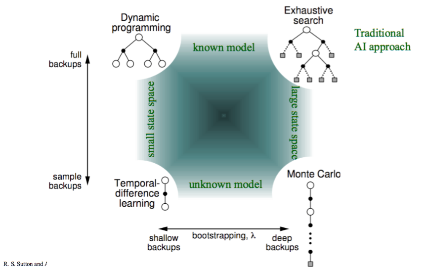

# 多步 TD

## 简介

在本章前面的部分中，我们研究了强化学习中两种基本的时间差分（TD）方法：Q-learning和SARSA。

这两种方法在基本形式上存在一些弱点：

1. 与蒙特卡洛方法不同，蒙特卡洛方法获得奖励后反向传播这一奖励，而TD方法使用自举法（它们使用$Q(s,a)$估计未来折扣奖励），这意味着对于奖励稀疏的问题，奖励可能需要很长时间才能在Q函数中传播。
2. 奖励可能是稀疏的，意味着只有少数状态/动作会导致非零奖励。这是个问题，因为初始阶段，强化学习算法的行为完全随机，很难找到好的奖励。
3. 这两种方法都估计Q函数$Q(s,a)$，建模最简单的方式是通过Q表。然而，这要求我们维护一个大小为$|A| \times |S|$的表格，对于任何非平凡问题，这都是难以承受的大小。
4. 使用Q表要求我们多次访问每个可达状态并多次应用每个动作，以获得$Q(s,a)$的良好估计。因此，如果我们从未访问过状态$s$，即使我们已经访问过与$s$非常相似的状态，我们也无法估计$Q(s,a)$。

为了解决限制1和2，我们将研究n步时间差分学习：蒙特卡洛技术执行整个回合然后反向传播奖励，而基本TD方法只关注下一步的奖励并估计未来奖励。n步方法则在更新奖励前向前看$n$步，然后估计剩余部分。在这些笔记的后续部分，我们将研究减轻限制3和4的技术。

n 步 TD 学习源自下图所示的思想，来自Sutton和Barto（2020）。蒙特卡洛方法使用"深度备份"，执行整个回合并反向传播奖励。Q-learning和SARSA等方法使用"浅层备份"，只使用前方1步的奖励。n步学习找到了中间立场：只有在向前探索$n$步后才更新Q函数。

## N-step TD Learning

我们将研究n步强化学习，其中$n$是决定在更新Q函数前要向前看多少步的参数。当$n=1$时，这就是"普通"的TD学习，如Q-learning或SARSA。当$n=2$时，算法会比即时奖励多看一步；$n=3$时会多看两步，以此类推。

Q-learning和SARSA都有各自的n步版本。我们将首先更一般地研究n步学习，然后展示n步SARSA的算法。Q-learning的版本与之类似

### 折扣未来奖励

当计算一个回合的折扣奖励时，我们简单地对回合中的奖励进行求和：

$$ G_t = r_1 + \gamma r_2 + \gamma^2 r_3 + \gamma^3 r_4 + \ldots $$

我们可以将其重写为：

$$ G_t = r_1 + \gamma(r_2 + \gamma(r_3 + \gamma(r_4 + \ldots))) $$

如果 $G_t$ 是在时间步 $t$ 收到的值，那么：

$$ G_t = r_t + \gamma G_{t+1} $$

在Q-learning和SARSA等TD(1)方法中，我们在更新$Q(s, a)$时不知道$G_{t+1}$，所以我们使用自举法进行估计：

$$ G_t = r_t + \gamma \cdot V(s_{t+1}) $$

也就是说，从步骤$t$开始的整个未来奖励被估计为$t$时的奖励加上从$t+1$开始的估计（折扣）未来奖励。$V(s_{t+1})$使用最大期望回报（Q-learning）或下一个动作的估计值（SARSA）来估计。

这是一步回报。

### 截断折扣奖励

然而，我们可以估计两步回报：

$$ G^2_t = r_t + \gamma r_{t+1} + \gamma^2 V(s_{t+2}) $$

三步回报：

$ G^3_t = r_t + \gamma r_{t+1} + \gamma^2 r_{t+2} + \gamma^3 V(s_{t+3}) $

或n步回报：

$$ G^n_t = r_t + \gamma r_{t+1} + \gamma^2 r_{t+2} + \ldots \gamma^n V(s_{t+n}) $$

在上面的表达式中，$G^n_t$是在时间$t$处截断到$n$步的完整奖励。

n步强化学习的基本思想是，我们不会在执行动作后立即更新Q值：我们等待$n$步，然后基于n步回报进行更新。

如果$T$是终止步骤且$t + n \geq T$，那么我们就使用完整的奖励。

在蒙特卡洛方法中，我们一直到回合的结束。蒙特卡洛树搜索是这样的蒙特卡洛方法之一，但还有其他我们不涉及的方法。

### 更新Q函数

更新规则因此不同。首先，我们需要计算$n$步的截断奖励，其中$\tau$是我们要更新的时间步（即，$\tau$是$n$步前采取的动作）：

$$ G \leftarrow \sum^{\min(\tau+n, T)}_{i=\tau+1}\gamma^{i-\tau-1}r_i $$

这只是从时间步$\tau+1$开始，到$n$步（$\tau+n$）或回合终止（$T$）为止（以先到者为准）的折扣奖励求和。

然后计算n步期望奖励：

$$ \text{如果 } \tau+n < T \text{ 那么 } G \leftarrow G + \gamma^n Q(s_{\tau+n}, a_{\tau+n}). $$

如果我们不在回合的结束处（如果$\tau+n < T$），这会添加未来期望奖励。

最后，我们更新Q值：

$$ Q(s_{\tau}, a_{\tau}) \leftarrow Q(s_{\tau}, a_{\tau}) + \alpha[G - Q(s_{\tau}, a_{\tau})] $$

在上面的更新规则中，我们使用的是SARSA更新，但Q-learning的更新也类似。

### N-step SARSA

虽然概念上这并不困难，但实现n步学习的算法需要存储$n$步的奖励和观察到的状态，并跟踪要更新的步骤。下面是n步SARSA的算法。

$$\begin{array}{l} Input:\ \text{MDP}\ M = \langle S, s_0, A, P_a(s' \mid s), r(s, a, s')\rangle\, \text{number of steps n}\\ Output:\ \text{Q-function}\ Q\\[2mm] \text{Initialise}\ Q\ \text{arbitrarily; e.g., }\ Q(s, a)=0\ \text{for all}\ s\ \text{and}\ a\\[2mm] Repeat \\ \quad\quad \text{Select action}\ a\ \text{to apply in}\ s\ \text{using Q-values in}\ Q\ \text{and}\\ \quad\quad\quad\quad \text{a multi-armed bandit algorithm such as}\ \epsilon\text{-greedy}\\ \quad\quad \vec{s} = \langle s\rangle\\ \quad\quad \vec{a} = \langle a\rangle\\ \quad\quad \vec{r} = \langle \rangle\\ \quad\quad While\ \vec{s}\ \text{is not empty}\ do\\ \quad\quad\quad\quad\ If\ s\ \text{is not a terminal state}\ Then\\ \quad\quad\quad\quad\quad\quad \text{Execute action}\ a\ \text{in state}\ s\\ \quad\quad\quad\quad\quad\quad \text{Observe reward}\ r\ \text{and new state}\ s'\\ \quad\quad\quad\quad\quad\quad \vec{r} \leftarrow \vec{r} + \langle r\rangle\\ \quad\quad\quad\quad\quad\quad If\ s'\ \text{is not a terminal state}\ Then\\ \quad\quad\quad\quad\quad\quad\quad\quad \text{Select action}\ a'\ \text{to apply in}\ s'\ \text{using}\ Q\ \text{and a multi-armed bandit algorithm}\\ \quad\quad\quad\quad\quad\quad\quad\quad \vec{s} \leftarrow \vec{s} + \langle s' \rangle\\ \quad\quad\quad\quad\quad\quad\quad\quad \vec{a} \leftarrow \vec{s} + \langle a' \rangle\\ \quad\quad\quad\quad If\ |\vec{r}| = n\ or\ s\ \text{is a terminal state}\ if\\ \quad\quad\quad\quad\quad\quad G \leftarrow \sum^{|\vec{r}| - 1}_{i=0}\gamma^{i}\vec{r}_i\\ \quad\quad\quad\quad\quad\quad if\ s\ \text{is not a terminal state}\ then\\ \quad\quad\quad\quad\quad\quad\quad\quad G \leftarrow G + \gamma^n Q(s', a')\\ \quad\quad\quad\quad\quad\quad Q(\vec{s}_0, \vec{a}_0) \leftarrow Q(\vec{s}_0, \vec{a}_0) + \alpha[G - Q(\vec{s}_0, \vec{a}_0)]\\ \quad\quad\quad\quad\quad\quad \vec{r} \leftarrow \vec{r}_{[1 : n + 1]}\\ \quad\quad\quad\quad\quad\quad \vec{s} \leftarrow \vec{s}_{[1 : n + 1]}\\ \quad\quad\quad\quad\quad\quad \vec{a} \leftarrow \vec{a}_{[1 : n + 1]}\\ \quad\quad\quad\quad s \leftarrow s'\\ \quad\quad\quad\quad a \leftarrow a'\\ Until\ Q\ \text{converges} \end{array} $$

这与标准SARSA类似，不同之处在于我们存储了最近 $n$ 个状态、动作和奖励；并且基于最近的多个奖励而不仅仅是一个来计算回报。变量 $\vec{s}$、$\vec{a}$ 和 $\vec{r}$ 分别表示最近 $n$ 个状态、动作和奖励的列表。我们使用 $\vec{s}i$ 来获取列表的第$i$个元素，并使用类似Python的语法 $\vec{s}{[1:n+1]}$ 来获取索引1到 $n+1$ 之间的元素（移除第一个元素）。

与SARSA和Q-learning一样，我们对回合中的每一步进行迭代。第一个分支简单地执行选定的动作，选择要应用的新动作，并存储状态、动作和奖励。

实际的学习发生在第二个分支。我们不是仅使用1步奖励 $r$ 进行更新，而是使用 $n$ 步奖励 $G$。这需要一些"记账"工作。首先，我们计算 $G$。这只是对奖励序列 $\vec{r}$ 中的元素进行求和，但要记住它们必须根据在 $\vec{r}$ 中的位置进行折扣。下一行将TD估计 $\gamma^n Q(s', a')$ 添加到 $G$ 中，但仅当最近的状态不是终止状态时才这样做。如果我们已经到达了回合的结束，那么我们必须排除未来奖励的TD估计，因为不会有这样的未来奖励。重要的是，我们也注意到这里乘以的是 $\gamma^n$ 而不是 $\gamma$。为什么？这是因为估计的未来奖励距离状态 $\vec{s}_0$ 有 $n$ 步。$G$中的$n$步奖励先到。然后我们进行实际更新，更新的是$n$步之前的状态-动作对 $(\vec{s}_0, \vec{a}_0)$。

这个分支的最后部分从状态、动作和奖励列表中移除第一个元素，并移至下一个状态。

所有这些计算的效果是什么？该算法与标准SARSA的不同之处如下：它只在看到接下来的 $n$ 个返回的奖励后才更新状态-动作对，而不是仅看到单个下一个奖励。这意味着在回合的第 $n$ 步之前没有更新；并且在回合的最后$n$步中没有未来奖励的TD估计。

从计算角度看，这比1步学习并不差多少。我们需要存储最近的 $n$ 个状态，但每步计算对于n步来说是小而均匀的，就像对于1步一样。

## N 的取值

我们是否可以将$n$增加到无限大，从而获得整个回合的奖励？这样做实际上等同于蒙特卡洛强化学习，因为我们在更新规则中不再使用TD估计。正如我们所见，这会导致学习过程中出现更大的方差。

那么$n$的最佳值是多少？遗憾的是，对于$n$没有理论上的最佳值。它取决于特定的应用场景和正在训练的奖励函数。在实践中，$n$取值在$4-8$左右似乎能提供良好的更新效果，因为我们可以轻松地将功劳分配给这$4-8$个动作；也就是说，我们可以判断前瞻中的$4-8$个动作是否对得分有贡献，因为我们使用了TD估计。

## 总结

* n步强化学习将奖励向后传播$n$步以帮助学习过程。
* 从概念上讲，它相当简单，但实现上需要大量的"记账"工作。
* 为特定领域选择合适的$n$值需要实验和直觉判断。
