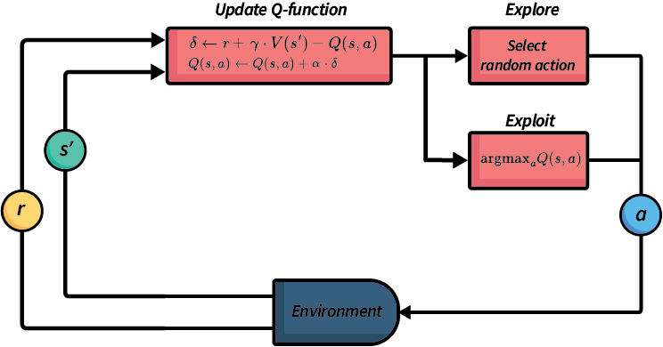

# Temporal difference reinforcement learning

## Model-based vs model-free

价值迭代是一类被称为基于模型的技术的解决方案。这意味着我们需要知道模型；特别是，我们可以访问 $P(s'|s, a)$ 和 $R(s, a, s')$。

在本节中，我们将研究 Q-learning 和 SARSA，它们是无模型技术。这意味着我们不知道模型的 $P(s'|s, a)$ 和 $R(s, a, s')$。

如果我们不知道转移概率和奖励，我们如何计算策略呢？我们通过尝试动作并观察结果来从经验中学习，这使其成为一个机器学习问题。

重要的是，在无模型强化学习中，我们不尝试学习 $P(s'|s, a)$ 或 $R(s, a, s')$ — 我们直接学习价值函数或策略。

在基于模型和无模型之间还有一种方法：基于模拟的技术。在这些情况下，我们有一个作为模拟器的模型，所以我们可以模拟 $P(s'|s, a)$ 和 $R(s, a, s')$ 并用无模型技术学习策略，但我们不能"看到" $P(s'|s, a)$ 和 $R(s, a, s')$，所以像价值迭代这样的基于模型的技术是不可能的。

## Model-free Reinforcement Learning

无模型强化学习有许多不同的技术，但它们都基于相同的基本原理。

* 我们执行我们想要解决的问题的许多不同回合（episodes），以学习一个策略。
* 在每个回合中，我们在执行动作和学习策略之间循环。
* 当我们的智能体执行一个动作时，我们会获得一个奖励（可能为0），并且我们可以看到执行该动作后产生的新状态。
* 基于此，我们强化我们对在先前状态下应用先前动作的估计。
* 然后，我们选择一个新的动作并在环境中执行它。
* 我们重复这个过程，直到以下情况之一发生：(1) 训练时间用完；(2) 我们认为我们的策略已经收敛到最优策略；或 (3) 我们的策略"足够好"（对于每个新回合，我们看到的改进微乎其微）。在实践中，很难知道我们是否已经收敛到最优策略。

## Monte-Carlo Reinforcement Learning

Monte-Carlo 强化学习可能是最简单的强化学习方法，它基于动物如何从环境中学习。其直觉相当简单。维护一个 Q 函数，记录每个状态-动作对的值 $Q(s, a)$。在每一步：(1) 使用多臂老虎机算法选择一个动作；(2) 应用该动作并获得奖励；(3) 基于该奖励更新 $Q(s, a)$。在多个回合中重复，直到... 什么时候？

它被称为 Monte-Carlo 强化学习，是以摩纳哥（法国里维埃拉的一个小公国）内的蒙特卡洛地区命名的，该地区以其奢华的赌场而闻名。由于赌博和赌场在很大程度上与机会相关，使用一些随机性来探索动作的模拟通常被称为蒙特卡洛方法。

算法 3 (Monte-Carlo 强化学习)

$$\begin{array}{l} \text{初始化}\ Q(s, a) \text{为任意值}\\ \text{初始化}\ N(s, a) = 0\\ \text{对所有}\ s \in S, \ a \in A(s)\ \text{重复（对每个回合）:}\\ \quad \text{初始化}\ S_0\\ \quad \pi \leftarrow \text{从}\ Q\ \text{派生的策略（例如，}\epsilon\text{-贪心）}\\ \quad \text{按照}\ \pi\ \text{生成一个回合：}\ S_0, A_0, R_1, S_1, A_1, R_2, ..., S_{T-1}, A_{T-1}, R_T, S_T\\ \quad G \leftarrow 0\\ \quad \text{对于}\ t = T-1, T-2, ..., 0\ \text{执行:}\\ \quad\quad G \leftarrow \gamma G + R_{t+1}\\ \quad\quad \text{如果这是第一次访问}\ (S_t, A_t)\ \text{在回合中:}\\ \quad\quad\quad N(S_t, A_t) \leftarrow N(S_t, A_t) + 1\\ \quad\quad\quad Q(S_t, A_t) \leftarrow Q(S_t, A_t) + \frac{1}{N(S_t, A_t)}[G - Q(S_t, A_t)]\ \end{array}$$

该算法按照某种策略（如 $\epsilon$-贪心）生成整个回合，观察每一步 $t$ 的奖励 $R_t$。然后计算每一步的折扣未来奖励 $G$。如果 $(S_t, A_t)$ 在回合中较早出现，那么我们不更新 $Q(S_t, A_t)$，因为我们将在循环的后面更新它。如果它没有出现，我们将 $Q(S_t, A_t)$ 更新为所有回合中执行 $(S_t, A_t)$ 的所有执行的累积平均值。在此算法中，$N(S_t, A_t)$ 表示在所有回合中评估 $(S_t, A_t)$ 的次数。

## Q-Table

Q-table 是维护 Q 函数的最简单方式。它们是一个表格，为每个 $(s, a)$ 对都有一个条目。因此，与价值迭代中的价值函数一样，它们不能扩展到大型状态空间。（关于扩展的更多内容将在下一讲中介绍）。

最初，我们会有一个任意的 Q-table，如果所有值都初始化为零，在 GridWorld 示例中可能看起来像这样：

|状态/动作|	上|	右|	下|	左|
|---|---|---|---|---|
|(0, 0)|	0|	0|	0|	0|
|(0, 1)|	0|	0|	0|	0|
|(0, 2)|	0|	0|	0|	0|
|(1, 0)|	0|	0|	0|	0|
|(1, 1)|	0|	0|	0|	0|
|(1, 2)|	0|	0|	0|	0|
|(2, 0)|	0|	0|	0|	0|
|(2, 1)|	0|	0|	0|	0|
|(2, 2)|	0|	0|	0|	0|
经过一些训练后，我们可能会得到一个看起来像这样的 Q 函数：

|状态/动作|	上|	右|	下|	左|
|---|---|---|---|---|
|(0, 0)|	0.4|	0.5|	0.3|	0.2|
|(0, 1)|	0.3|	0.6|	0.4|	0.5|
|(0, 2)|	0.2|	0.1|	0.5|	0.7|
|(1, 0)|	0.5|	0.7|	0.2|	0.1|
|(1, 1)|	0.6|	0.8|	0.4|	0.6|
|(1, 2)|	0.3|	0.2|	0.7|	0.9|
|(2, 0)|	0.6|	0.1|	0.1|	0.2|
|(2, 1)|	0.8|	0.2|	0.2|	0.3|
|(2, 2)|	0.0|	0.0|	0.0|	0.0|

在强化学习过程中，随着智能体探索环境并更新 Q 值，这个表格会逐渐填充有意义的值，反映每个状态-动作对的预期未来奖励。例如，在这个例子中，我们可以看到如果目标位于 (2, 2)（可能是终止状态，所以所有动作的 Q 值都为 0），随着接近目标，导向目标的动作的 Q 值变得更高。从 (1, 2) 向左移动和从 (2, 1) 向上移动的较高值表明这些动作是通向目标的最佳路径。

## Temporal Difference(TD) 

Monte Carlo 强化学习虽然简单，但它存在一些问题。最重要的是它具有高方差。回想一下，我们计算一个回合的未来折扣奖励，并用它来计算每个状态-动作对的平均奖励。然而，$G$ 通常不是我们将获得的平均未来奖励的好估计。如果我们在不同的回合中多次在状态 $s$ 执行动作 $a$，我们可能会发现在此之后执行的未来轨迹差异很大，因为我们使用的是 Monte Carlo 模拟。这意味着需要很长时间才能学习到该状态-动作对的真实平均奖励的良好估计。

时间差分（TD）方法通过引入自举（bootstrapping）来缓解这个问题。与价值迭代通过使用上一次迭代的价值函数进行自举的方式类似，在 TD 方法中，我们不是基于 $G$（即回合中实际接收到的未来折扣奖励）进行更新，而是基于实际接收到的即时奖励加上我们对未来折扣奖励的估计进行更新。

这种方法减少了估计的方差，因为我们不需要等待整个回合完成才能更新值估计。相反，我们可以在每一步之后立即进行更新，使用当前的估计来改进我们的预测。这种增量学习方法通常收敛更快，特别是在长回合或连续任务中。

在 TD 方法中，我们的更新规则总是遵循这样的模式：

$$Q(s, a) \leftarrow \underbrace{Q(s, a)}_\text{old value} + \overbrace{\alpha}^{\text{learning rate}} \cdot [\underbrace{\overbrace{r}^{\text{reward}} + \overbrace{\gamma}^{\text{discount factor}} \cdot V(s')}_{\text{TD target}} - \overbrace{Q(s, a)}^{\text{do not count extra } Q(s, a)}]$$

其中 $Q_{next}$ 是我们对平均未来奖励的 TD 估计，是我们未来折扣奖励的自举值。新信息的权重由参数 $\alpha$（读作"alpha"）决定，它是学习率。较高的学习率 $\alpha$ 会给最近的信息比旧信息更高的权重，所以学习会更快，但会使稳定更加困难，因为它受异常值的强烈影响。

这个想法是，随着时间的推移，TD 估计会比我们在一个回合中收到的实际奖励更稳定，收敛到由贝尔曼方程定义的最优值函数 $V^*$，这导致 $Q(s, a)$ 更快地收敛。

为什么方括号内有表达式 $- Q(s, a)$？这是因为旧值的权重是 $(1 - \alpha)$。我们可以将其展开为 $Q(s, a) \leftarrow (1-\alpha) \cdot Q(s, a) + \alpha \cdot [R + \gamma \cdot Q_{next}]$，然后可以将后面的 $(1-\alpha) \cdot Q(s, a)$ 移到方括号内，应用学习率 $\alpha$。

在本章中，我们将研究两种 TD 方法，它们在估计未来奖励 $V(s^{\prime})$ 的方式上有所不同：

* Q-learning，我们称之为离策略（off-policy）方法；
* SARSA，我们称之为在策略（on-policy）方法。

## Q-Learning

Q-learning 是强化学习的基础方法。它是一种 TD 方法，使用 Q 函数本身来估计未来奖励 $V(s')$，假设从状态 $s'$ 开始，在每个状态都会执行（根据 $Q$ 函数）最佳的动作。

以下是 Q-learning 算法。它使用 $\max_{a'} Q(s', a')$ 作为 $V(s')$ 的估计；也就是说，它通过使用 $Q$ 函数来估计从 $s'$ 开始的最佳动作的价值。这有助于稳定学习过程。

注意，与 Monte Carlo 强化学习不同，由于 Q-learning 使用自举值，它可以交替执行动作和更新，这意味着 $Q$ 函数在一个回合的每一步都得到改进，而不必等到回合结束才计算 $G$。这使得早期回合比在 Monte Carlo 强化学习中受益更多。

$$\begin{array}{l}
Input:\  \text{MDP}\ M = \langle S, s_0, A, P_a(s' \mid s), r(s, a, s')\rangle\\
Output:\ \text{Q-function}\ Q\\[2mm]
\text{Initialise}\ Q\ \text{arbitrarily; e.g., }\ Q(s, a) \leftarrow 0\ \text{for all}\ s\ \text{and}\ a\\[2mm]
Repeat \\
\quad\quad s \leftarrow\ \text{the first state in episode}\ e\\
\quad\quad Repeat\ \text{(for each step in episode}\ e \text{)}\\
\quad\quad\quad\quad \text{Select action}\ a\ \text{to apply in}\ s; \\
\quad\quad\quad\quad\quad\quad \text{e.g. using}\ Q\ \text{and a multi-armed bandit algorithm such as}\ \epsilon\text{-greedy}\\
\quad\quad\quad\quad \text{Execute action}\ a\ \text{in state}\ s\\
\quad\quad\quad\quad \text{Observe reward}\ r\ \text{and new state}\ s'\\
\quad\quad\quad\quad \delta \leftarrow r + \gamma \cdot \max_{a'} Q(s', a') - Q(s, a)\\
\quad\quad\quad\quad Q(s, a) \leftarrow Q(s, a) + \alpha \cdot \delta\\
\quad\quad\quad\quad s \leftarrow s'\\
\quad\quad Until\ s\ \text{is the last state of episode}\ e\ \text{(a terminal state)}\\
Until\ Q\ \text{converges}
\end{array}$$

### 更新 Q-function

更新 Q-function 是个学习过程:

$$\delta \leftarrow [\underbrace{\overbrace{r}^{\text{reward}} + \overbrace{\gamma}^{\text{discount factor}} \cdot \overbrace{\max_{a'} Q(s', a')}^{V(s') \text{ estimate}}}_{\text{TD target}}  \overbrace{- Q(s, a)}^{\text{do not count extra } Q(s, a)}]$$

$$Q(s, a) \leftarrow 
\underbrace{Q(s, a)}_\text{old value} + \overbrace{\alpha}^{\text{learning rate}} \cdot \underbrace{\delta}_{\text{delta value}}$$

我们可以看到，在每一步中，$Q(s, a)$ 的更新是通过取 $Q(s, a)$ 的旧值并加上新信息来完成的。

来自新观察的估计由 $\delta$ 给出，其中 $\delta$ 是先前估计与最新观察之间的差异，$r$ 是在状态 $s$ 执行动作 $a$ 后获得的奖励，$Q(s, a)$ 是时间差分目标。这表明基于新信息的 $Q(s, a)$ 估计是奖励 $r$ 加上从状态 $s'$ 开始的估计折扣未来奖励。$\delta$ 的定义是类似于贝尔曼方程的更新。我们不知道 $P(s'|s, a)$，所以无法直接计算贝尔曼更新，但我们可以使用 $Q(s, a)$ 和时间差分目标来估计这个值。

### 使用 Q-functions 的策略提取

使用 Q-functions 的策略提取
在无模型学习中，我们迭代尽可能多的回合，或者直到每个回合几乎不再改进我们的 Q 值。这给我们提供了一个（接近）最优的 Q 函数。

一旦我们获得了这样的 Q 函数，我们就停止探索而只进行利用。我们使用策略提取，方式与价值迭代中的做法完全相同，只是我们从 Q 函数而非价值函数中提取：

$$\pi(s) = \text{argmax}_{a \in A(s)} Q(s, a)$$

这会选择具有最大 Q 值的动作。给定一个最优的 Q 函数（对于 MDP），这将产生最优行为。

当我们的 Q 函数收敛到最优 Q 函数时，根据贝尔曼最优方程，我们可以保证这种策略提取方法会产生最优策略。这也是为什么 Q-learning 被称为"离策略"学习 - 我们可以使用任何探索策略来学习 Q 值，但最终提取的是一个贪心策略。

## SARSA

SARSA (state-action-reward-state-action) 是一种在线策略（on-policy）强化学习算法。它与 Q-learning 非常相似，不同之处在于其更新规则：SARSA 不是使用 $\max_{a'} Q(s', a')$ 来估计未来折扣奖励，而是实际选择它将要执行的下一个动作，并使用该动作进行更新。这种方法被称为在策略强化学习。在本节后面，我们将讨论为什么这很重要，但现在，让我们更深入地了解 SARSA 算法和在策略学习。

SARSA 算法与 Q-learning 非常相似，但关键区别在于它如何估计未来状态的价值。它使用实际选择的下一个动作，而不是假设会选择最佳动作。这更符合智能体的实际行为，特别是当智能体正在执行非贪心策略（如 $\epsilon$-贪心）时。

> 定义: 
> 与离策略学习在更新时估计 $\max_{a'} Q(s', a')$ 不同，在策略强化学习使用实际选择的下一个动作来进行更新。
>  
> 在策略学习估计当前行为策略 $\pi$ 下的状态-动作对 $Q(s, a)$ 值，而离策略学习则估计独立于当前行为的策略。

$$\begin{array}{l}
Input:\  \text{MDP}\ M = \langle S, s_0, A, P_a(s' \mid s), r(s, a, s')\rangle\\
Output:\ \text{Q-function}\ Q\\[2mm]
\text{Initialise}\ Q\ \text{arbitrarily; e.g., }\ Q(s, a) \leftarrow 0\ \text{for all}\ s\ \text{and}\ a\\[2mm]
Repeat \\
\quad\quad s \leftarrow\ \text{the first state in episode}\ e\\
\quad\quad \text{Select action}\ a\ \text{to apply in}\ s; \\
\quad\quad\quad\quad \text{e.g. using}\ Q\ \text{and a multi-armed bandit algorithm such as}\ \epsilon\text{-greedy}\\
\quad\quad Repeat\ \text{(for each step in episode}\ e \text{)}\\
\quad\quad\quad\quad \text{Execute action}\ a\ \text{in state}\ s\\
\quad\quad\quad\quad \text{Observe reward}\ r\ \text{and new state}\ s'\\
\quad\quad\quad\quad \text{Select action}\ a\ \text{to apply in}\ s'; \\
\quad\quad\quad\quad\quad\quad \text{e.g. using}\ Q\ \text{and a multi-armed bandit algorithm such as}\ \epsilon\text{-greedy}\\
\quad\quad\quad\quad \delta \leftarrow r + \gamma \cdot  Q(s', a') - Q(s, a)\\
\quad\quad\quad\quad Q(s, a) \leftarrow Q(s, a) + \alpha \cdot \delta\\
\quad\quad\quad\quad s \leftarrow s'\\
\quad\quad\quad\quad a \leftarrow a'\\
\quad\quad Until\ s\ \text{is the last state of episode}\ e\ \text{(a terminal state)}\\
Until\ Q\ \text{converges}
\end{array}$$

## 局限性

我们在本节中讨论的标准 Q-learning 和 SARSA 算法存在两个主要局限性：

* 由于 Q-learning 需要通过 $\max_{a'} Q(s', a')$ 选择最佳动作，我们必须遍历所有可能的动作。这将 Q-learning 限制在离散动作空间上应用。
* 如果我们使用 Q-table 来表示 Q 函数，则状态空间和动作空间都必须是离散的，并且规模必须适中。否则，Q-table 将变得过大而无法装入内存，或者至少会变得如此之大，以至于需要经过大量回合才能对所有状态-动作对进行足够的采样。

## 总结

* 在策略强化学习使用策略选择的动作进行更新。
* 离策略强化学习假设下一个选择的动作是具有最大$Q$值的动作，但实际情况可能并非如此，因为算法有一定概率会进行探索而非利用。
* Q-Learning（离策略）相对于贪心策略进行学习。
* SARSA（在策略）学习的动作价值是相对于它所遵循的策略。
* 如果我们知道MDP，我们可以使用基于模型的技术：
  + 离线：价值迭代
  + 在线：蒙特卡洛树搜索及其相关算法 
* 即使我们知道MDP模型，我们也可以使用无模型技术：我们只需从模型中采样转移并观察奖励。
* 如果我们不知道MDP，我们需要使用无模型技术：
  + 离线：Q-learning、SARSA及其相关算法
