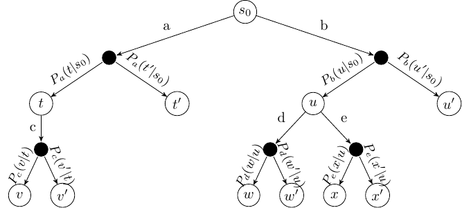
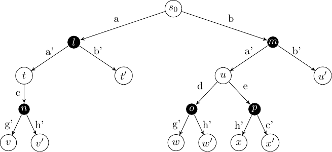

# 多智能体强化学习

回想我们在蒙特卡洛树搜索部分首次遇到的期望最大化树（ExpectiMax trees）概念。期望最大化树是马尔可夫决策过程（MDPs）的一种表示方法。请记住，白色节点代表状态，而黑色节点则代表我们视为环境做出的选择：

扩展型博弈树可以看作是对期望最大化树的一种细微修改，区别在于黑色节点的选择不再由"环境"决定，而是由另一个智能体做出：

../_images/mcts_game_tree.png 图 16 作为强化学习问题的扩展型博弈树

从这个可视化中，我们可以看出扩展型博弈可以通过无模型强化学习技术和蒙特卡洛树搜索技术来解决：我们可以将对手视为环境；尽管这是一个自身也有特定目标的环境。

## 随机博弈

> 定义 – 随机博弈

随机博弈是一个元组 $G = (S, s_0, A^1, \ldots A^n, r^1, \ldots, r^n, Agt, P, \gamma)$，其中：

* $S$ 是状态集合
* $s_0$ 是初始状态
* $A^j$ 是智能体 $j$ 的行动集合
* $P: S \times A^1 \times \ldots A^n \rightarrow \Omega(S)$ 是转移函数，定义了在给定起始状态和所有参与者选择的行动下，到达某一状态的概率
* $r^j : S \times A^1 \times \ldots A^n \times S \rightarrow \mathbb{R}$ 是智能体 $j$ 的奖励函数
* $\gamma$ 是折扣因子

从这个定义中我们可以看出两点：

1. 随机博弈实际上是马尔可夫决策过程的一个版本，其中行动空间和奖励空间是元组：每个智能体都有一个行动和一个奖励。事实上，它是MDPs的泛化形式，因为我们可以简单地设置 $n=1$，就得到了标准的MDP。
2. 随机博弈是扩展型博弈的泛化。也就是说，我们可以将任何扩展型博弈表示为随机博弈；但反之则不成立，因为例如，扩展型博弈中的行动是确定性的，且多个智能体不能同时执行行动。然而，我们可以通过限制除一个参与者外的所有参与者只能执行一个"空"行动（不产生任何效果）来模拟扩展型博弈。

## 随机博弈的解法

在随机博弈中，解是一组策略：每个智能体 $j$ 都有一个策略 $\pi^j$。所有智能体的联合策略简单表示为

$$\pi = [\pi^1, \ldots \pi^n]$$

智能体的目标是最大化自身的期望折扣累积奖励：

$$V^{\pi^j}(s) = E_{\pi^j}[\, \sum_{i} \gamma^i \, r^j(s_i, a, s_{i+1}) \ | \ s_0 = s, a = \pi(s_i)]$$

注意，$a = \pi(s_i)$ 是所有智能体的联合行动。因此，每个智能体的目标是在考虑所有其他智能体可能采取的行动的情况下，最大化自身的期望奖励。

## 多智能体Q学习

鉴于MDPs和随机博弈之间的相似性，我们可以将标准的Q学习算法重新构建为多智能体版本。

**算法18（多智能体Q学习）**

$$ \begin{array}{l} Input:\ \text{Stochastic game}\ G = (S, s_0, A^1, \ldots A^n, r^1, \ldots, r^n, Agt, P, \gamma)\\ Output:\ \text{Q-function}\ Q^j\ \text{where}\ j\ \text{is the}\ \mathit{self}\ \text{agent}\\[2mm] \text{Initialise}\ Q^j\ \text{arbitrarily; e.g., }\ Q^j(s, a)=0\ \text{for all states}\ s\ \text{and joint actions}\ a\\[2mm] Repeat \\ \quad\quad s \leftarrow \text{the first state in episode}\ e\\ \quad\quad repeat\ \text{(for each step in episode}\ e \text{)}\\ \quad\quad\quad\quad \text{Select action}\ a^j\ \text{to apply in s; }\\ \quad\quad\quad\quad\quad\quad \text{e.g. using}\ Q^j\ \text{and a multi-armed bandit algorithm such as}\ \epsilon\text{-greedy}\\ \quad\quad\quad\quad \text{Execute action}\ a^j\ \text{in state} s\\ \quad\quad\quad\quad \text{Observe reward}\ r^j\ \text{and new state}\ s'\\ \quad\quad\quad\quad Q^j(s, a) \leftarrow Q^j(s, a) + \alpha \cdot [r^j + \gamma \cdot \max_{a'} Q^j(s', a') - Q^j(s, a)]\\ \quad\quad\quad\quad s \leftarrow s'\\ \quad\quad until\ \text{the end of episode}\ e\ \text{(a terminal state)}\\ until\ Q\ \text{converges} \end{array}$$

这与标准的Q学习完全相同。这种学习效果很好，因为MDPs的模型足够通用，对手的行动可以被简单地近似为环境的一部分。

然而，如果我们只想解决一个扩展型博弈，即参与者轮流行动的情况，我们可以对上述算法稍作修改，通过修改算法的执行和更新部分，使对手的行动更加明确：

$\begin{array}{l} \quad\quad\quad\quad \text{在状态}\ s\ \text{中执行行动}\ a^j\\ \quad\quad\quad\quad \text{等待其他智能体的行动（通过模拟或实际对弈）}\\ \quad\quad\quad\quad \text{观察奖励}\ r_t^j, \ldots, r_{t+n}^j\ \text{和新状态}\ s_{t+n}\\ \quad\quad\quad\quad Q^j(s, a) \leftarrow Q^j(s, a) + \alpha\cdot [r_t^j + \ldots + r_{t+n}^j + \gamma \cdot \max_{a'} Q^j(s_{t+n}, a') - Q^j(s, a)] \end{array}$

这个算法与前一个主要有两个不同之处：

1. 执行我们的行动后，我们不会立即观察到下一个状态，而是等到轮到我们再次行动时，观察状态 $s_{t+n}$，其中其他智能体已经进行了 $n-1$ 个行动。
2. 我们观察到在该序列中收到的所有奖励，包括来自其他智能体的奖励。

对于扩展型博弈，这两种算法是等效的，然而，与其为不轮到行动的智能体模拟"空"行动，通常使用后者会更简单且计算开销更小。

这些算法效果良好，因为学习与所有其他智能体无关。这被称为独立学习。然而，它假设所有其他智能体的策略是静态的——即假设其他智能体的策略不会随时间变化。这是一个局限，但有几种技术不做这种假设，这些技术超出了本笔记的范围。不过，我们可以讨论一些建模对手以改进多智能体Q学习的方法。

当然，不仅仅是Q学习可以扩展到多智能体情况。价值迭代、SARSA和基于策略的方法也可以类似地扩展。在最简单的情况下，它们只需像我们上面所做的那样进行小的更改；然而，专门针对处理多个智能体的更复杂版本将会带来更好的结果。

### 对手行动

我们需要回答的主要问题是：如果我们在离线学习，如何"决定"对手的行动？

在真正的无模型问题中，我们无法模拟对手，但对手会执行自己的行动，所以我们不需要模拟。

然而，如果我们在没有真实对手的模拟环境中学习，我们需要自己模拟对手的行动，而不是简单地"等待"他们的行动。我们应该如何为对手的行动选择行动？有几种方法：

1. 随机选择：选择一个随机行动。这很简单，但意味着我们可能会探索许多好的对手永远不会采取的行动，因此我们会为自己的行动学习到较差的Q值。
2. 使用固定策略：我们可以使用现有的随机策略，为对手提供合理的行为。这可以是手工编码的或从类似博弈中学习的。
3. 自我对弈：我们可以同时学习自己和对手的策略，并根据学习到的策略为对手选择行动。如果我们的行动空间相同，如在象棋和井字棋等博弈中，我们可以学习单一策略，让自己和对手都使用它。这是AlphaZero使用的技术。

## 多智能体蒙特卡洛树搜索

正如我们将Q学习扩展到多智能体情况一样，我们可以通过对算法进行小的更改，将蒙特卡洛树搜索扩展到多智能体情况。

多智能体MCTS与单智能体MCTS类似。我们只需对基本MCTS算法进行如下修改：

1. 选择：对于"我们的"行动，我们像以前一样进行选择，但我们还需要为对手选择模型。在多智能体MCTS中，一种简单的方法是通过自我对弈。每个节点都有轮到行动的参与者，我们使用多臂赌博机算法为该参与者选择行动。
2. 扩展：我们不是基于 $P_a(s' \mid s)$ 扩展子节点，而是扩展我们的一个行动，这会导向对手的节点。在下一次迭代中，该节点成为扩展节点。
3. 模拟：然后我们像以前一样进行模拟，并在收到奖励时进行学习。请记住，奖励是一个向量，每个参与者都有一个奖励。
4. 反向传播：反向传播步骤与以前相同，只是我们需要为每个参与者保存节点的值，而不仅仅是为自己。

## 总结

1. 对于在无模型或模拟环境中解决扩展型博弈，我们可以以直接的方式将Q学习、SARSA和MCTS等技术从单智能体扩展到多智能体环境。
2. 对于真正的随机博弈（具有同时行动），存在其他更复杂的技术，如均场Q学习，它通过近似所有行动对之间的联合行动，而不是所有智能体之间的全局交互，减少了行动之间可能的交互数量。
