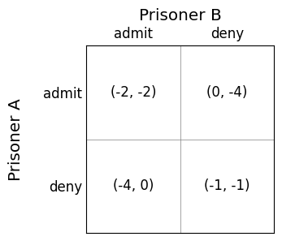

# 标准形式博弈

## 简介

标准形式博弈在多智能体系统领域有着广泛的应用。我们将着眼于其基础内容，重点关注确定性和随机性策略。本章将讲解如何从理论上解决这类问题。

这类问题可以用以下二维矩阵表示：

囚徒A和囚徒B是参与者，认罪和否认是可选行动，矩阵中的数值代表给予玩家的效用或收益。例如，如果两名囚徒都选择认罪，则两人都将获得两年监禁，因此每位囚徒的效用为-2。左侧单元格表示囚徒A的效用，右侧单元格表示囚徒B的效用。

那么，每个囚徒应该怎么做呢？让我们先列出关于博弈的一些假设，这些是我们在本章中将始终坚持的一般性假设：

1. 我们假设所有智能体都是理性的，这意味着他们的目标是最大化自身的总效用。
2. 我们假设所有智能体都是自利的，这意味着他们不关心其他智能体的效用。
3. 我们假设博弈是完全信息博弈，这意味着博弈规则对所有智能体来说都是共同知识；也就是说，所有智能体都知道规则，包括所有其他智能体的行动和效用，所有智能体都知道所有智能体都知道规则，所有智能体都知道所有智能体都知道所有智能体都知道规则，以此类推，无限循环。简而言之，不存在通过利用对方不知道的信息来"欺骗"另一个智能体的可能性。

基于这些假设，两个智能体都应选择认罪，结果是两人都被判处两年监禁。这可能令人惊讶：如果两人都选择否认，他们每人只会被判一年监禁。为什么他们会选择在监狱中度过更长的时间呢？

答案完全归结于自利：他们并不是试图最小化两人在监狱中共同度过的时间。相反，每个人都在尝试最小化自己在监狱中度过的时间。

让我们从一个智能体的角度来看这个问题。你最初的直觉可能是这样思考："如果我选择认罪，那么我的对手可能会认罪或否认。如果他们认罪，那么我的效用是-2"，等等。然而，也许一个更好的思考方式是反过来："如果我的对手认罪，我应该怎么做？"

如果我们这样推理，就能清楚地看到为什么两个玩家都会认罪。由于博弈是对称的，我们只需要为一个玩家进行推理：

1. 如果我的对手认罪，那么我应该认罪，效用为-2，而不是否认，否则效用为-4。
2. 如果我的对手否认，那么我应该认罪，效用为0，而不是否认，否则效用为-1。

所以，无论我的对手做什么，我的最佳行动都是认罪。同样，我的对手也可以按照同样的方式推理，他们的最佳行动也是认罪。因为我们双方都这样推理，并且都是自利的，我们最终都被判两年监禁而不是一年。有趣的是，我们无法利用这种推理来超越对手。如果我们"知道"他们会认罪，转而否认并不是一个好的回应：我们将面临四年监禁而不是两年！这就是为什么它被称为囚徒困境：两个囚徒都知道有一个对双方都更好的结果，但是他们都没有动机去否认。

现在我们已经看过一个例子，让我们来看看标准形式博弈的更正式定义。

标准形式博弈是一个元组 $G = (N, A, u)$

* $N$ 是 $n$ 个玩家的集合
* $A = A_1 \times \ldots \times A_n$ 是行动配置，其中 $A_i$ 是玩家 $i$ 的行动集合。因此，一个行动配置 $a = (a_1, \ldots, a_n)$ 描述了所有玩家的同时行动。
* $u : A \rightarrow \mathbb{R}^N$ 是一个奖励函数，返回一个 $N$ 元组，指定每个玩家在状态 $S$ 中获得的收益。这被称为行动的效用。

标准形式博弈可以如上面囚徒困境所示，以矩阵形式可视化，每个智能体代表矩阵的一个维度，每行代表一个玩家的行动，每个单元格代表玩家采取相应行动时获得的效用。

## 标准形式博弈的解决方案：策略

在标准形式博弈中，玩家的解决方案被称为策略。策略有几种类型。

> 定义 – 纯策略: 纯策略是指智能体选择单一行动并执行它。如果智能体多次参与同一博弈，他们每次都会选择相同的行动。

> 定义 – 混合策略: 混合策略是指智能体基于某种概率分布选择要执行的行动。例如，我们以0.8的概率选择行动$a$，以0.2的概率选择行动$b$。如果智能体无限次参与博弈，它将80%的时间选择$a$，20%的时间选择$b$。

请注意，纯策略是混合策略的一种特殊情况，即其中一个行动的概率为1。

我们将智能体的策略集合称为策略配置。智能体$i$的策略配置表示为$S_i$。注意$S_i \neq A_i$，因为$S_i$包含混合策略。所有智能体的混合策略配置集合简单表示为$S = S_1 \times \ldots S_n$。

我们使用符号$S_{-i}$表示除智能体$i$外所有智能体的混合策略配置集合，并用$s_{-i} \in S_{-i}$表示该集合中的一个元素。

智能体为何要在选择行动时使用随机化策略并不是立即显而易见的，但我们将看到一些这样做很重要的例子。

定义 – 占优策略: 

如果智能体$i$采用策略$s_i$获得的效用大于或等于采用策略$s'_i$获得的效用，则策略$s_i$弱占优于策略$s'_i$。形式化地说，$s_i$弱占优于$s'_i$当且仅当：

$$\textrm{对于所有}\ s_{-i} \in S_{-i}, \textrm{我们有} u_i(s_i, s_{-i}) \geq u_i(s'i, s{-i})$$

如果策略$s_i$的效用严格大于策略$s'_i$的效用，则策略$s_i$强占优于策略$s'_i$。形式化地：

$$\textrm{对于所有}\ s_{-i} \in S_{-i}, \textrm{我们有} u_i(s_i, s_{-i}) > u_i(s'i, s{-i})$$

如果一个策略弱（或强）占优于所有其他策略，则它是弱（或强）占优策略。

占优策略是防策略的：即使我们提前告诉对手这是我们将要选择的策略，这也不会给他们任何优势：它仍然是一个占优策略。

在囚徒困境博弈中，认罪的策略是严格占优的：无论对手采取什么策略，这都是最佳的行动选择。

## 最佳响应与纳什均衡

首先，我们从智能体的最佳响应角度来研究如何解决博弈问题。然后，我们探讨均衡的概念，它捕捉了整个博弈的解决方案。最佳响应的概念指的是当智能体知道博弈中所有其他智能体将如何行动时，该智能体可以选择的最佳策略。

> 定义 – 最佳响应: 当对手采用策略配置 $s_{-i} \in S_{-i}$ 时，智能体 $i$ 的最佳响应是一个混合策略 $s^*_i \in S_i$，使得对于所有策略 $s'_i \in S_i$ 都有 $u_i(s^*_i, s_{-i}) \geq u_i(s'_i, s_{-i})$

需要注意的是，对于许多问题，可能存在多个最佳响应。

基于此，我们可以定义博弈的纳什均衡，它以著名数学家约翰·纳什命名，他在博士论文中证明了所有有限标准形式博弈都有纳什均衡。非正式地说，纳什均衡是所有智能体 $N$ 的一个稳定策略配置，在这种配置下，如果所有其他智能体保持其策略不变，任何智能体都没有动机改变自己的策略。

> 定义 – 纳什均衡: 如果对于所有智能体 $i$，策略 $s_i$ 都是对策略 $s_{-i}$ 的最佳响应，则策略配置 $s = (s_1, \ldots, s_n)$ 是纳什均衡。

如果纳什均衡中的所有策略都是纯策略，我们称之为纯策略纳什均衡。否则，它是混合策略纳什均衡。

之所以称为"均衡"，是因为它是稳定的。实际上，这意味着博弈中的每个玩家都没有动机偏离这一策略。事实上，如果玩家 $A$ 告诉玩家 $B$ 他们将要采用什么策略，玩家 $B$ 甚至无法利用这一信息——均衡的策略仍然是最佳策略。在给定玩家 $B$ 策略的情况下，玩家 $A$ 对自己的策略感到满意，同样，在给定玩家 $A$ 策略的情况下，玩家 $B$ 对自己的策略也感到满意。

## 计算最佳响应和纳什均衡

标准形式博弈的最佳响应集可以通过搜索所有策略来计算，找出那些具有最高收益的策略。

> 算法（最佳响应）

$$  \begin{array}{l} Input:\ \text{Normal form game}\ G = (N, A, u)\\ Input:\ \text{agent}\ i\\ Input:\ \text{and strategy profile}\ s_{-i}\ \text{for agents other than}\ i\\ Output:\ \text{Set of best responses}\\[2mm] best\_response = \emptyset\\ best\_response\_value = -\infty\\ foreach\ s_i \in S_i\\ \quad\quad if\ u(s_i, s_{-i}) > best\_response\_value\ then\\ \quad\quad\quad\quad best\_response = \{s_i\}\\ \quad\quad elsif\ u(s_i, s_{-i}) = best\_response\_value\ then\\ \quad\quad\quad\quad best\_response = best\_response \cup \{s_i\}\\ return\ best\_response \end{array} $$

该算法的复杂度为 $O(|S_i|)$：我们只需检查每个策略一次。

以囚徒困境为例。显然，两个智能体的最佳响应都是唯一的认罪策略。

寻找纳什均衡涉及搜索所有策略配置，并找出其中所有智能体的策略都是该配置下的最佳响应的配置。以下是寻找双人标准形式博弈的纳什均衡的算法：

> 算法（纳什均衡）

$$ \begin{array}{l} Input:\ \text{Normal form game}\ G = (N, A, u)\\ Output:\ \text{Set of Nash equilibria}\\[2mm] nash\_equilibria = \emptyset\\ foreach\ s_1 \in A_1\\ \quad\quad foreach\ s_2 \in A_2\\ \quad\quad\quad\quad if \ s_i \in BestResponse(i, s_j)\ and\ s_j \in BestResponse(j, s_i)\ then\\ \quad\quad\quad\quad\quad\quad nash\_equilibria = nash\_equilibria \cup \{(s_i, s_j)\}\\ return\ nash\_equilibria \end{array} $$

非正式地说，给定一个标准形式博弈，我们可以查看博弈的每个单元格 $(s_1, s_2)$，并沿着行和列搜索，以确定任何玩家是否可以通过改变其策略（而其他智能体的策略保持不变）来获得更好的效果。

要搜索纯策略均衡，我们只需设置 $S_i \leftarrow A_i$；也就是说，我们只搜索纯策略。

## 混合策略

回想本章前面我们定义的混合策略，即使用随机化的策略。为了说明为什么这些是必要的，考虑以下简单博弈。

为此，我们需要定义期望效用和无差异性的概念。

> 定义 – 纯策略的期望效用

期望效用是智能体采用特定纯策略所获得的加权平均值。对于一个行动 $a_i \in A_i$，该行动的期望效用为：

$$ U_i(a_i) = p_1 \times u_i(a_i, a^1_{-i}) + \ldots + p_m \times u_i(a_i, a^m_{-i}) $$

其中 $a^1_{-i}, \ldots, a^m_{-i}$ 是除智能体 $i$ 外所有智能体的行动配置，而 $p_1, \ldots, p_m$ 是对手采取这些行动配置的概率。

理论上，我们可以通过选择具有最高期望效用的纯策略来最大化我们的总体效用。然而，在博弈中，我们不知道对手会以什么概率采取这些行动！这就是无差异性的作用所在。

> 定义 – 无差异性: 如果对于所有 $a_i, a_j \in I$，都有 $U_i(a_i) = U_i(a_j)$，则智能体 $i$ 对一组纯策略 $I \subseteq A_i$ 无差异。

非正式地说，这表明如果所有策略的期望回报相同，智能体对一组纯策略无差异。因此，智能体对这些纯策略无差异，因为它们选择哪种行动并不重要。

> 定义 – 混合策略纳什均衡: 混合策略纳什均衡是一个混合策略配置 $S$，使得每个智能体 $i \in N$ 的策略是一个概率元组 $P_i = (p_1, \ldots, p_m)$，对应于每个纯策略，且满足 $p_1 + \ldots + p_m = 1$，并且所有对手 $j$ 对其纯策略 $A_j$ 无差异。

非正式地说，这表明每个智能体应该选择一个混合策略，使其对手对自己的行动无差异。直觉上，这似乎没有太大意义：每个智能体的策略是使其对手对自己的策略无差异。然而，如果我们从对手的角度分析，就会变得清晰：如果我们为混合策略选择的概率使得我们的对手不是无差异的，那么这意味着至少有一个策略具有比所有其他策略更高的期望效用。在这种情况下，对手会选择那个策略。

## 总结

* 标准形式博弈模型描述的是智能体同时采取行动的非顺序博弈。
* 智能体可以采用纯策略或混合策略。我们将分析哪些策略是有效的，以及这些策略与纳什均衡之间的关系。
